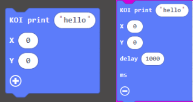
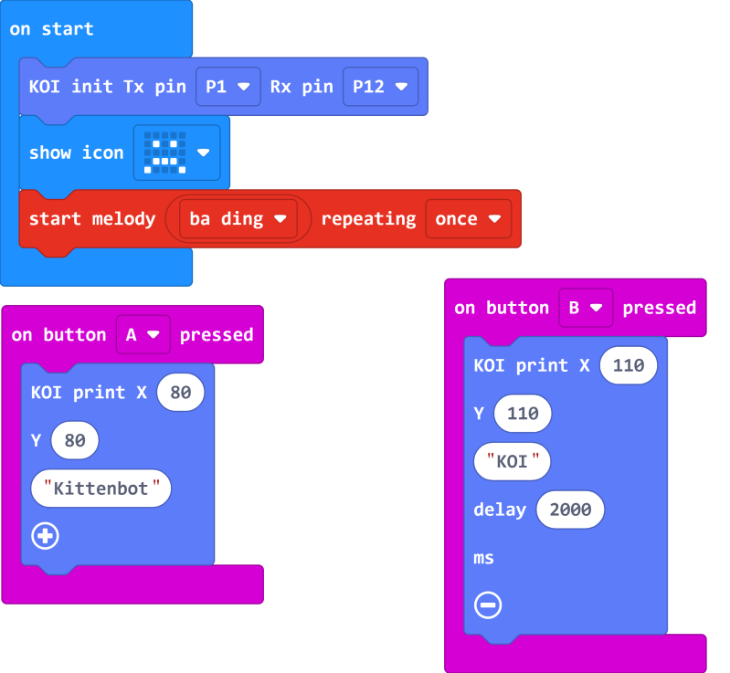

# **Displaying Text**

English strings can be displayed on the KOI screen.

## Displaying Text

### Load KOI Extension: https://github.com/KittenBot/pxt-koi

### [Loading Extensions](../../Makecode/powerBrickMC)

Blocks for displaying text:

 
 
We can add a delay to specify the duration shown.

The coordinates refer to the top left corner of the text. See figure below for explaination of coordinates.

### Sample Program:

## Program

Download the program to Micro:bit.

Pressing button A on the Micro:bit to display "Kittenbot" on the screen. Pressing button B to display "KOI" for 2 seconds.

## Sample Code

[Displaying Text (Extension0.5.7)](https://makecode.microbit.org/_haY9xhetabD6)

## Extension Version and Updates

There may be updates to extensions periodically, please refer to the following link to update/downgrade your extension.

[Makecode Extension Update](../../Makecode/makecode_extensionUpdate)

## FAQ

### 1: There is no reaction after pressing the buttons on the Micro:bit.

·    A: This is because KOI has a longer boot time than Micro:bit. When the power is turned on, Micro:bit has already ran the code for KOI initialization before KOI is ready.

·    Solution: Reset your Micro:bit after KOI has been turned on. (The trick is to let KOI power on completely before initialization.)

### 2: Does KOI work with 3V input?

·    A: No, KOI only works with 5V.

### 3: Why does the text disappear after a short while?

·    A: Since the dislay of the KOI keeps refreshing, the text cannot persist on the screen for a long time. For displaying persisting text, considering connecting an I2C OLED screen.