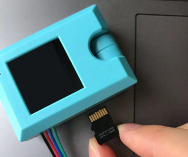
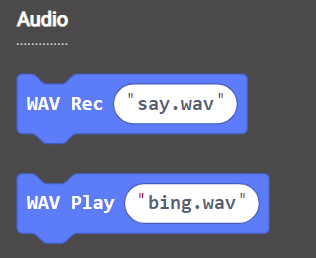
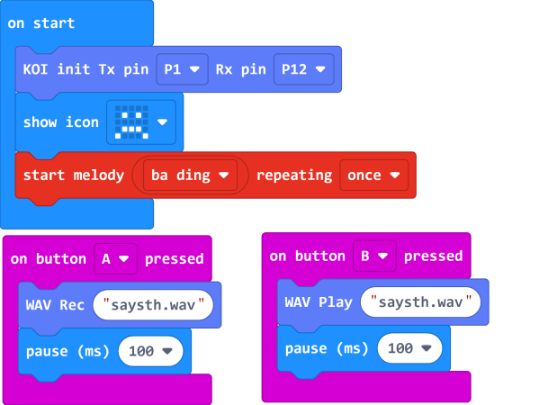

# **Recording and Playback**

With the built-in microphone and speaker, simple recording and playback is possible.

KOI can record a 3 second audio clip and saves the file as a wav format.

### Install an SD Card

 

    The pictures are stored onto an SD card, without an SD card, these operations would fail.

## Recording and playback

### Load KOI Extension: https://github.com/KittenBot/pxt-koi

### [Loading Extensions](../../Makecode/powerBrickMC)

Blocks for recording and playback:

 

### Sample Program:

  

## Program Flow

Download the program to Micro:bit.

1. Press button A on the Micro:bit, KOI will record what you say.
2. Press button B on the Micro:bit, KOI will playback the audio file.

## Sample Code

[Recording and playback (Extension0.5.7)](https://makecode.microbit.org/_irkWewakW2Fo)

## Extension Version and Updates

There may be updates to extensions periodically, please refer to the following link to update/downgrade your extension.

[Makecode Extension Update](../../Makecode/makecode_extensionUpdate)

## FAQ

### 1: There is no reaction after pressing the buttons on the Micro:bit.

·    A: This is because KOI has a longer boot time than Micro:bit. When the power is turned on, Micro:bit has already ran the code for KOI initialization before KOI is ready.

·    Solution: Reset your Micro:bit after KOI has been turned on. (The trick is to let KOI power on completely before initialization.)

### 2: Does KOI work with 3V input?

·    A: No, KOI only works with 5V.

### 3: Can I change the recording duration?

·    A: No, because recording duration is limited by the amount of RAM that KOI has.

### 4: Can I play mp3 files on the KOI?

·    A: No, KOI can only play wav files, and file size cannot exceed 512KB.

### 5: Can I create my own wav files to play on KOI?

·    A： Yes but make sure the duration is less than 3.75 seconds with a bitrate of less than 512kbps. The file size has to be within 512KB.
