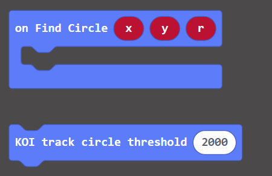
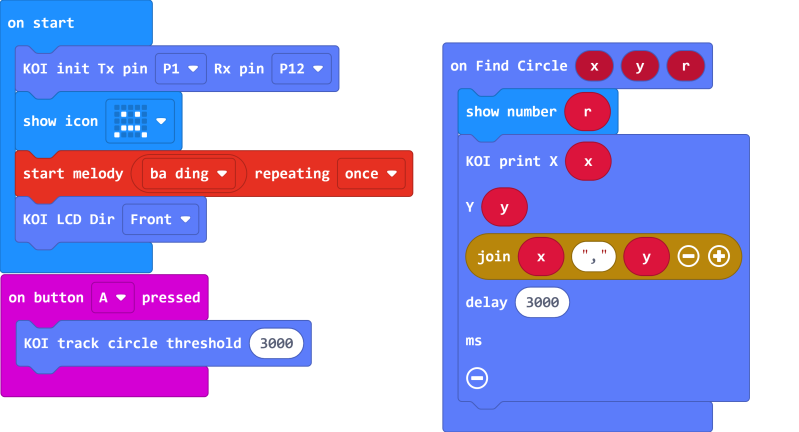
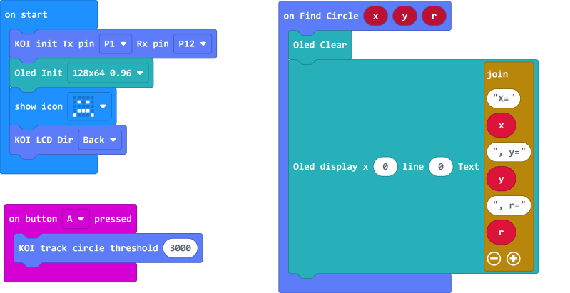

# **Circle Tracing**

KOI is able to find and track circles in a scene.

## Circle Tracing

### Load the KOI Extension: https://github.com/KittenBot/pxt-koi

### [Loading Extensions](../../Makecode/powerBrickMC)

Blocks for circle tracing:

 

### Sample Program

  

### Threshold

 

Threshold affects the detection rate, testing and fine tuning the value is needed for achieving the best results.

A higher threshold value decreases interference and noise, but detection difficulty increases at the same time, please trial and fine tune for different scenarios.

## Program Flow

Download the program to Micro:bit, then press A on the Micro:bit.

The radius of the circle is shown on the Micro:bit while its coordinates are shown on the KOI.

## Advanced Program

The information becomes more easily readable if we add an OLED screen.

### Connecting an OLED

Connect an OLED panel to the I2C port of your Robotbit/Armourbit.

 

### Sample Program

### Load the extension for OLED: https://github.com/KittenBot/pxt-oled

 

## Sample Code

[1. Circle Tracing (Extension0.5.7)](https://makecode.microbit.org/_h87fXzXxPhWU)

[2. Circle Tracing /w OLED (Extension0.5.7)](https://makecode.microbit.org/_eFkaX2iT57Hr)

## Extension Version and Updates

There may be updates to extensions periodically, please refer to the following link to update/downgrade your extension.

[Makecode Extension Update](../../Makecode/makecode_extensionUpdate)

## FAQ

### 1: There is no reaction after pressing the buttons on the Micro:bit.

·    A: This is because KOI has a longer boot time than Micro:bit. When the power is turned on, Micro:bit has already ran the code for KOI initialization before KOI is ready.

·    Solution: Reset your Micro:bit after KOI has been turned on. (The trick is to let KOI power on completely before initialization.)

### 2: Does KOI work with 3V input?

·    A: No, KOI only works with 5V.

### 3: How do I improve detection rate?

·    Adjust the threshold value.

·    Keep a clean background.

·    Make sure the circle has a sharp outline.