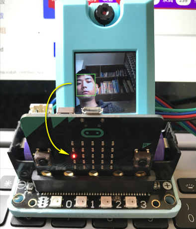

# **Face Detection**

Face detection has a wide range of application, we will learn how to do face detection in this tutorial.



## Detecting Faces



### Load KOI Extension: https://github.com/KittenBot/pxt-koi

### [Loading Extensions](../../Makecode/powerBrickMC)

Blocks for face detection:



### Sample Program:



## Program Flow

Download the program to the Micro:bit, the pixel on the Micro:bit 把程式下載到Microbit上，可以看到Microbit的點陣隨著人臉的移動而移動。

 

## Mapping coordinates

We can use the map function to map a value to a new range.



## Sample Code

[Face Detection (Extension0.5.7)](https://makecode.microbit.org/_2iYYjJcmjUkg)

## Extension Version and Updates

There may be updates to extensions periodically, please refer to the following link to update/downgrade your extension.

[Makecode Extension Update](../../Makecode/makecode_extensionUpdate)

## FAQ

### 1: There is no reaction after pressing the buttons on the Micro:bit.

·    A: This is because KOI has a longer boot time than Micro:bit. When the power is turned on, Micro:bit has already ran the code for KOI initialization before KOI is ready.

·    Solution: Reset your Micro:bit after KOI has been turned on. (The trick is to let KOI power on completely before initialization.)

### 2: Does KOI work with 3V input?

·    A: No, KOI only works with 5V.

