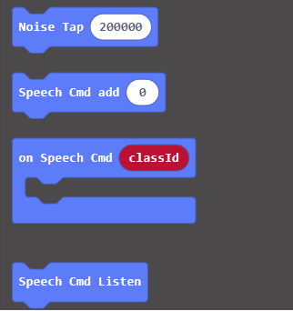
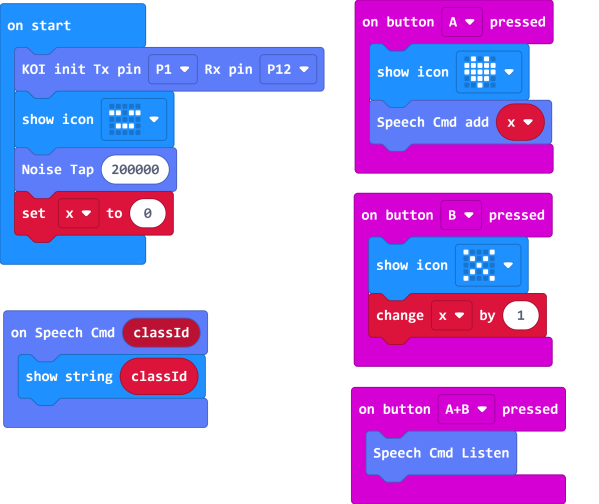
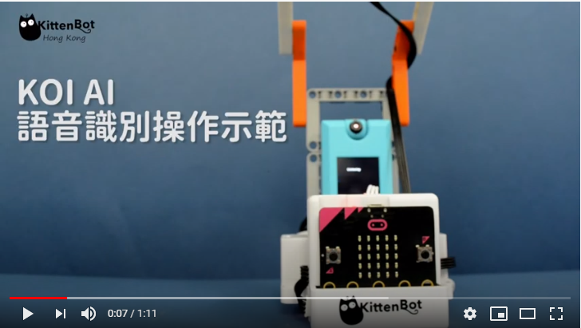

# **Voice Recognition (Firmware v1.9.5 or above)**

KOI is able to recognize our commands after training.

## Recognizing Voice Commands

### Load KOI Extension: https://github.com/KittenBot/pxt-koi

### [Loading Extensions](../../Makecode/powerBrickMC)

Blocks for voice recognition:

### Sample Program

## Program Flow

1: Download the program to the Micro:bit.

2: Press A and record the first command. A green color will be shown if the command has been successfully added. Otherwise red will be shown.

3: Press B to continue, you can now repeak step 2 and record the next command.

4: Repeat step 2-3 to record all your commands.

        AI Camera KOI has the capacity for 10 voice samples.

5: Press A and B at the same time to recognize a command. A green color will be shown if KOI successfully recognizes your command, else it will show a red color. The command ID will be shown on Micro:bit.

## Sample Codes

[1. Voice Recognition(Firmware1.9.5_Extension0.5.7)](https://makecode.microbit.org/_aqCH640XxJu5)

## Voice Recognition Demo Video

## Extension Version and Updates

There may be updates to extensions periodically, please refer to the following link to update/downgrade your extension.

[Makecode Extension Update](../../Makecode/makecode_extensionUpdate)

## FAQ

### 1: There is no reaction after pressing the buttons on the Micro:bit.

·    A: This is because KOI has a longer boot time than Micro:bit. When the power is turned on, Micro:bit has already ran the code for KOI initialization before KOI is ready.

·    Solution: Reset your Micro:bit after KOI has been turned on. (The trick is to let KOI power on completely before initialization.)

### 2: Does KOI work with 3V input?

·    A: No, KOI only works with 5V.

### 3: KOI displays red everytime I try to record my command.

·   A: The noise level hasn't been calibrated, it is essential to run the block before voice recognition.