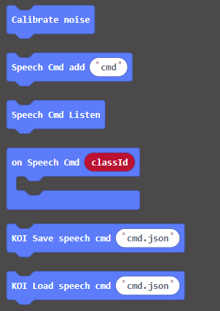
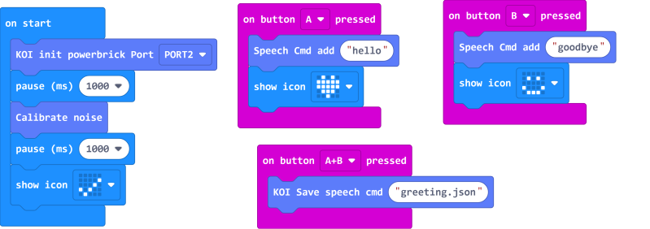

# **Voice Recognition Train Model(KOI v1.12.0)**

From KOI v1.12.0 onwards, saving and loading a voice recognition model is supported.

### Install an SD Card

The trained model will be stored on an SD card, without an SD card we won't be able to save this model.

## Training a Voice Recognition Model

### Load KOI Extension: https://github.com/KittenBot/pxt-koi

### [Loading Extensions](../../Makecode/powerBrickMC)

Blocks for Voice Recognition: 

### Sample Program:

## Program Flow

1: Download the program to the Micro:bit.

2: Press A to record the first command. KOI's screen will display green upon a successful record.

3: Press B to record the first command. KOI's screen will display green upon a successful record.

    AI Camera has the capacity for 10 voice samples.

4: Press A and B at the same time to save the model.

    The saved model must be in a .json format, or else it will not work.

## Sample Code

[1. Voice Recognition Model Training(Firmware1.9.5_Extension0.5.7)](https://makecode.microbit.org/_FdvWMfaoFHUb)

## Extension Version and Updates

There may be updates to extensions periodically, please refer to the following link to update/downgrade your extension.

[Makecode Extension Update](../../Makecode/makecode_extensionUpdate)

## FAQ

### 1: There is no reaction after pressing the buttons on the Micro:bit.

·    A: This is because KOI has a longer boot time than Micro:bit. When the power is turned on, Micro:bit has already ran the code for KOI initialization before KOI is ready.

·    Solution: Reset your Micro:bit after KOI has been turned on. (The trick is to let KOI power on completely before initialization.)

### 2: Does KOI work with 3V input?

·    A: No, KOI only works with 5V.

### 3: KOI displays red everytime I try to record my command.

·   A: The noise level hasn't been calibrated, it is essential to run the block before voice recognition.