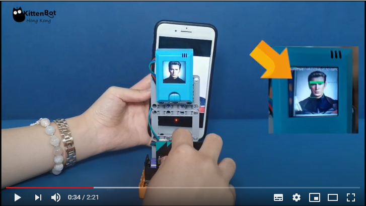

# **Face Recognition (KOI v1.9.5)**

Face Recognition is the technology of recognizing individuals from an image. This function can be realized on KOI.

## Face Recognition

### Load KOI Extension: https://github.com/KittenBot/pxt-koi

### [Loading Extensions](../../Makecode/powerBrickMC)

Blocks for Face Recognition:

### Sample Program:

    Wifi connection is required for Face Recognition.

    Face Recognition is a free feature, therefore you must choose a unique name for your class.
    For example, common names like testing, test1, class01 are already made by others.
    A maximum of 20 images can be stored in each class.

## Program Flow

1: Download the program to Micro:bit.

2: Press A to store a face to the class.

3: After a shortwhile, KOI will display the gender and the age of the face detected.

    You can change the name and reupload the program to store another face.

6: Press B to recognize a face

7: KOI will display the name of this face and its confidence. If a new face is detected, KOI will display "stranger".

    Confidence level can range from 0 to 100.

## Sample Code

[1. Face Recognition(Firmware1.12.0_Extension0.5.7)](https://makecode.microbit.org/_YdW8M1VW4UEb)

## Face Recognition Demo Video

## Extension Version and Updates

There may be updates to extensions periodically, please refer to the following link to update/downgrade your extension.

[Makecode Extension Update](../../Makecode/makecode_extensionUpdate)

## FAQ

### 1: There is no reaction after pressing the buttons on the Micro:bit.

·    A: This is because KOI has a longer boot time than Micro:bit. When the power is turned on, Micro:bit has already ran the code for KOI initialization before KOI is ready.

·    Solution: Reset your Micro:bit after KOI has been turned on. (The trick is to let KOI power on completely before initialization.)

### 2: Does KOI work with 3V input?

·    A: No, KOI only works with 5V.

### 3: KOI shows "Pic not has face" after taking a picture.

·    A: This is normal because the focus may be off, try taking the picture again.

### 3: KOI shows "Get timeout" after taking a picture.

·    A: This is because network conditions may not be good enough, or sometimes the server may be too busy.