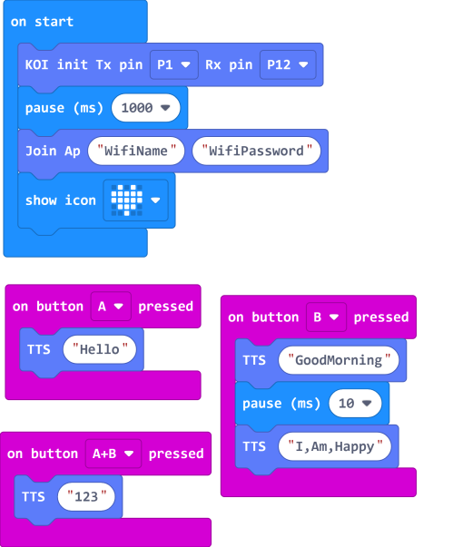

# **Text-to-Speech (KOI v1.9.5)**

By using BaiduAI, KOI can realize Text-to-Speech.

## Using Text to Speech

### Load KOI Extension: https://github.com/KittenBot/pxt-koi

### [Loading Extensions](../../Makecode/powerBrickMC)

Blocks for Text to Speech:

### Sample Program:

    Wifi connection is required to use text to speech function.

## Program Flow

1: Download the program to the Micro:bit.

2: Press A and KOI will say "Hello" in English.

3: Press B and KOI will say "Good Morning" and "I am happy" in English.
    
    The text to speech function only supports short phrases(2-3 words) and there must be no spaces between the words.

4: Press A and B and KOI will say "123" in Putonghua.

    MakeCode does not support Chinese chracters but BaiduAI does, so BaiduAI will treat numbers as Chinese.

## Sample Code

[1. Text to Speech(Firmware1.12.0_Extension0.5.7)](https://makecode.microbit.org/_H8JEtf7DR1D4)

## Extension Version and Updates

There may be updates to extensions periodically, please refer to the following link to update/downgrade your extension.

[Makecode Extension Update](../../Makecode/makecode_extensionUpdate)

## FAQ

### 1: There is no reaction after pressing the buttons on the Micro:bit.

·    A: This is because KOI has a longer boot time than Micro:bit. When the power is turned on, Micro:bit has already ran the code for KOI initialization before KOI is ready.

·    Solution: Reset your Micro:bit after KOI has been turned on. (The trick is to let KOI power on completely before initialization.)

### 2: Does KOI work with 3V input?

·    A: No, KOI only works with 5V.

