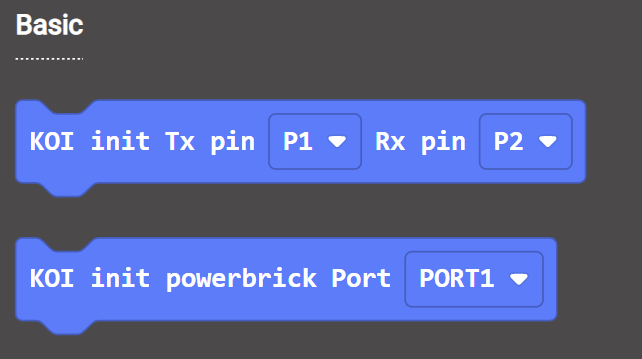
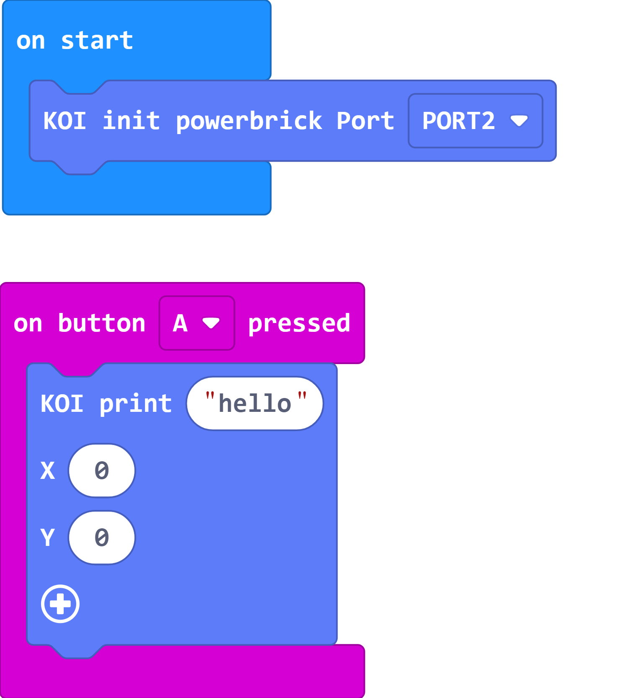
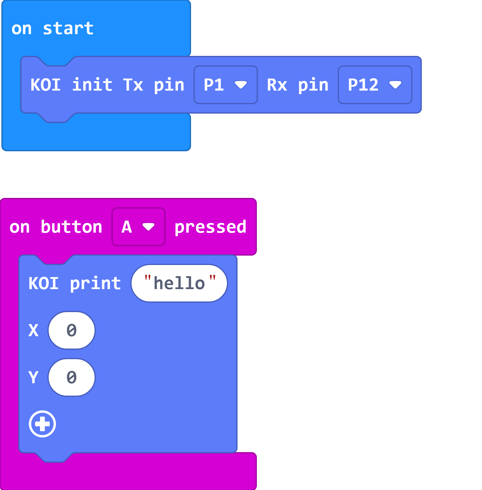
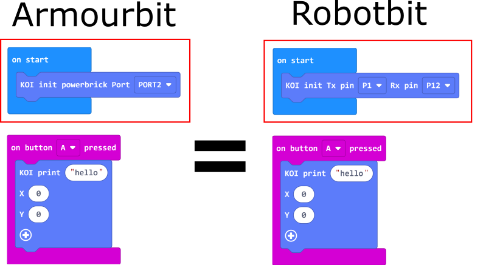

# **Interchanging between Armourbit and Robotbit**

KOI supports both Robotbit and Armourbit, the only difference is in the initialization.

## KOI Initialization

### Load KOI Extension: https://github.com/KittenBot/pxt-koi

### [Loading Extensions](../../Makecode/powerBrickMC)

Initialization Blocks:

For Armourbit users, choose "init powerbirck port".

For Robobit users, choose "init Tx Rx"

There are no difference between the 2 coding wise.

### In the following tutorials, Robotbit will be used. Armourbit users can modify the code based on this guide.