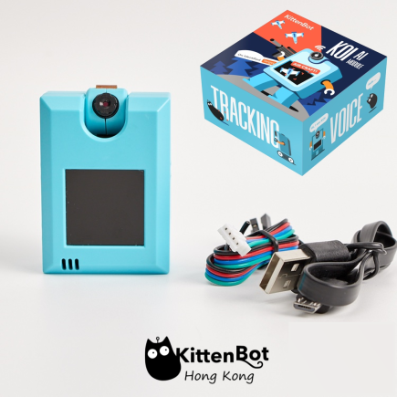
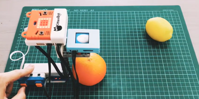
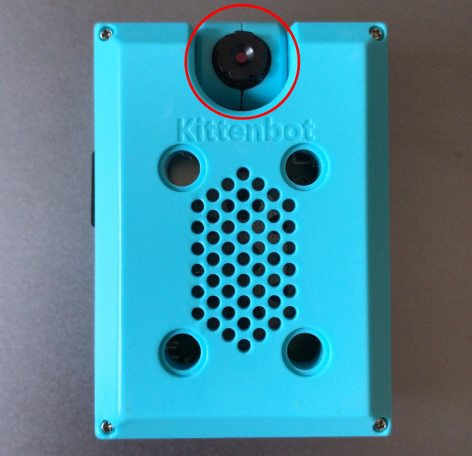
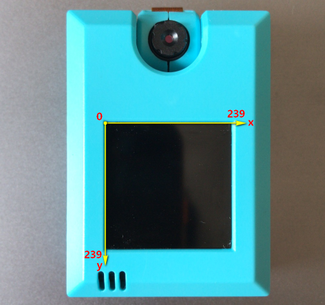
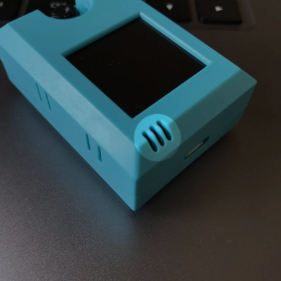
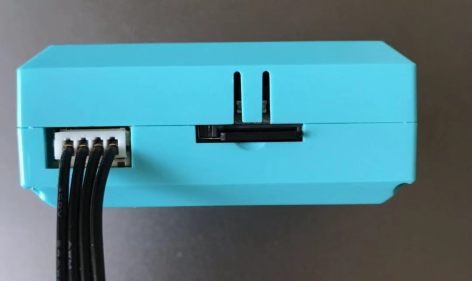

# **AI Camera KOI**

AI Camera KOI (HKBC8006A)

### **Online Shop**

Available to purchase at KidsLab. → [AI Camera KOI](https://kidslab.boutir.com/)

### **Package Content**

·    AI Camera KOI x1

·    MicroUSB Cable x1

·    PH2.0 to Dupont Cable x1

·    128MB MicroSD Card x1

### **Product Introduction**

·    **What is KOI?** 

AI Camera KOI is an offline Artificial Intelligence Module developed by Kittenbot. It is aimed to provide an easy to use platform for students and enthusiasts.KOI is an integrated module combining AI chip, camera, microphone, speaker, IPS display and Wifi chip into 1 convenient module.

AI Camera KOI has a lot of abilities, including Visual Recognition, Face Detection and Recognition, Object Classification, Speech Recognition and Text to Speech. With its built in Wifi chipset, you can even connect your KOI to the cloud for IoT AI Projects! 

KOI's functions can let you experience and learn Artificial Intelligence in a systematic way!

·    **Intended Audience:** 

STEM Education in Primary or Secondary Schools / STEM Enthusiasts / Advanced MakeCode or Kittenblock users

### **Features**

·    Combing AI and IoT functions, authentic offline AIoT projects can be realized 

·    Comprehensive peripherals are built in, a standalone module can realize AI functions including vision and speech

·    Supports both graphical programming and code based programming, suitable for beginners and makers alike

·    A customized classifier model can be trained, external models can also be imported from from SD Card

### **Intro Video**

     

[Youtube](https://youtu.be/7Bg_RKrhiEM)

### **List of functions**

### **Object Classification Demo**

  

[Youtube](https://youtu.be/sLrv9Ct-Fw4)

### **Specifications**

·    CPU: K210

·    Supported Micro Controllers: Microbit, Arduino series or any micro controller with serial support

·    Display Resolution: 1.3 inch 240x240 IPS

·    Camera Resolution: 640x480 RGB

·    Audio Input/Output: Outputs in 48khz mono, inputs in 8khz

·    SD Card Slot: Supported MicroSD Card, used to store classifier models, images and sounds, and Python code

·    WiFi Chipset: ESP8285

·    Data Output Channels: UART / WIFI /USB

·    Image Output Channels: USB / Wifi

·    Input Buttons: 2 Programmable Buttons

·    SD Card Support: 16 G

·    Voltage: 3.3~5v 

·    Supported Programming Platforms:

1. Kittenblock

2. Makecode

3. Micropython

4. Arduino (PlatformIO) 

### **KOI Close Up**

Let's take a closer look at the AI Camera KOI.

##### **Correct Orientation**

This is the default orientation of KOI.

 

##### **Camera Rotation**

The camera can be rotated from 0° to 180°. Be careful of the cable when rotating the camera.

##### **Front Camera Mode**

When both the camera and the display are facing towards you, the KOI is set up in Front Camera mode.

This is usually used in face detection or visual recognition.

  

##### **Back Camera Mode**

Wehn the camera and the display are facing the opposite the direction, the KOI is set up in Back Camera mode.

This is usually used in object classification, qr code/barcode recognition or line tracing.

  

##### **Display and Coordinates**

KOI uses an IPS display with a resolution of 240x240.

The origin of the coordinates is at the top left corner with (x,y)=(0,0).

Real time camera feed and system notifications will be displayed on the monitor.  

  

##### **A & B** and **Reset** Buttons

2 programmable buttons are found on both sides of the KOI, they function like the A and B buttons found on the Micro:bit.

A reset button is also found on the lower left hand side of the KOI, this is seldomly used. 

  

##### **Microphone**

At the bottom left of the module, a microphone can be found. This microphone picks up sound in a range of approximately 50cm.

  

##### **Micro USB Port**

This MicroUSB port is used to power the KOI or connect to a computer.  

  

##### **PH2.0 4PIN Connector**

This connector handles the serial communication between KOI and other micro controllers.

Pin out:  

  

Beginners are advised to use an Armourbit to prevent incorrect connection.

[Armourbit](../PWmodules/Armourbit)

  

##### **Micro SD Card Slot**

The SD card slot has an ejector mechanism, it supports cards up to 16GB. Images, sounds and classifier models will be saved to here. 

  

##### **Speaker**

The mono speaker is on the back of KOI.     

  

##### **LEGO Pin Connectors**

Round slots on the back of KOI are compatible with LEGO Technic pins.

Pin Connector Spacing:

Length: 4 spaces between pins

Width: 3 spaces between pins     

  