# KOI Programming with KittenBlock QuickStart

KOI can also be programmed using KittenBlock.

## Connecting the KOI

First, we need to establish connection with the KOI in KittenBlock.

Connect your KOI to the computer using a USB cable.

#### Select KOI from the hardware selector.

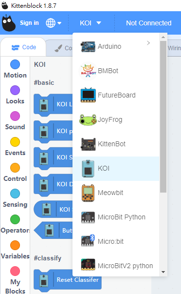

#### Click "Connect" or click the exclamation mark icon.

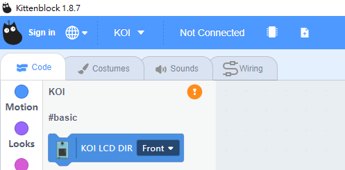

#### Click "Connect".

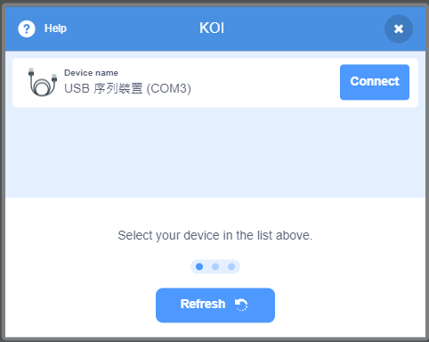

#### Wait for a few seconds.

#### Test the connection by clicking on any block.

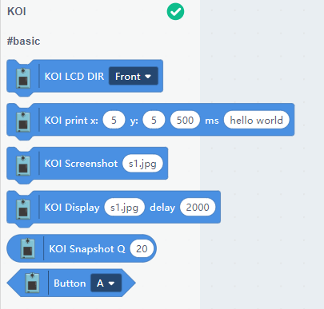

## KOI Programming on KittenBlock Guide

## Basic Operations

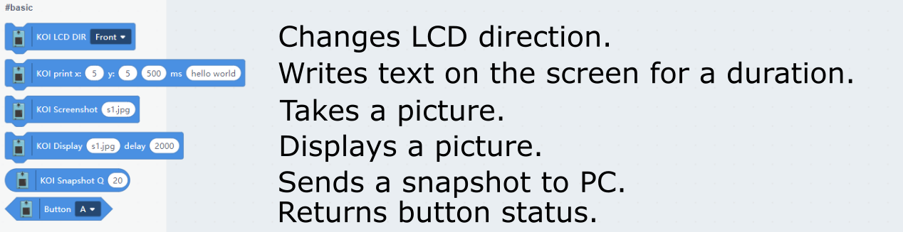

### Sample Program

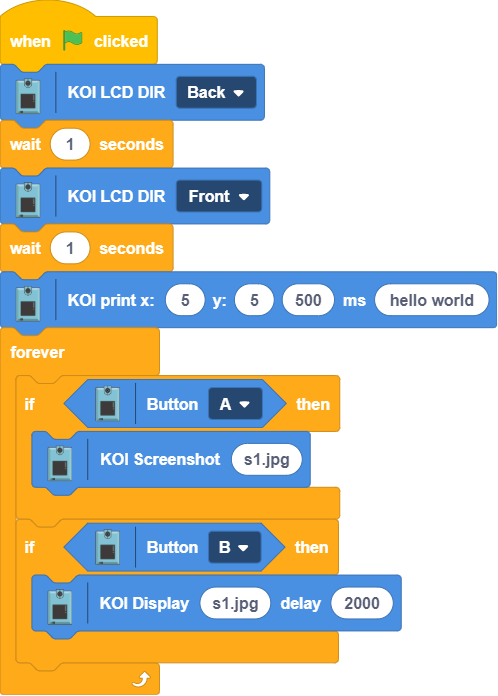

## Image Classifier

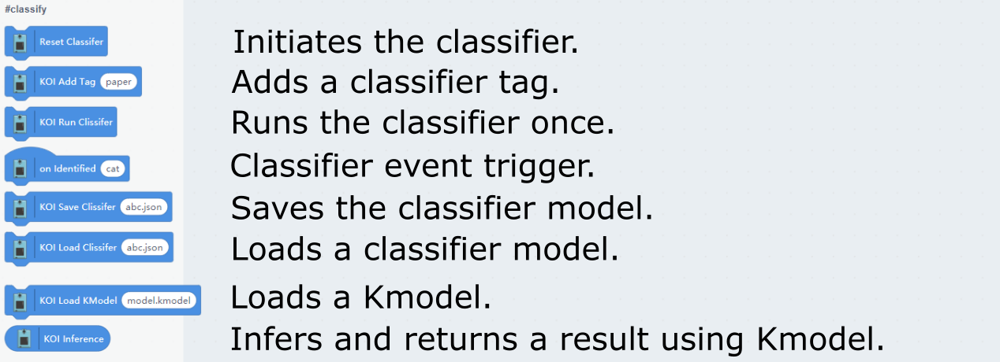

### Sample Program

#### Model Training

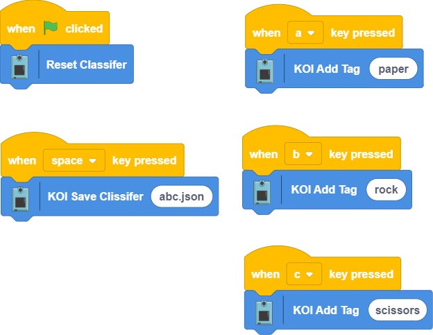

#### Image Classification

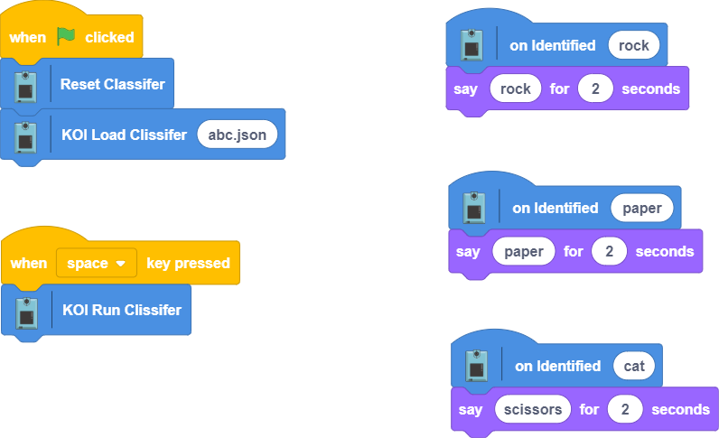

## Face Detection

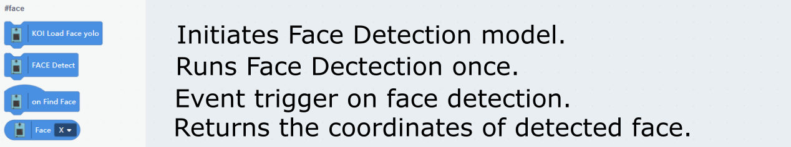

### Sample Program

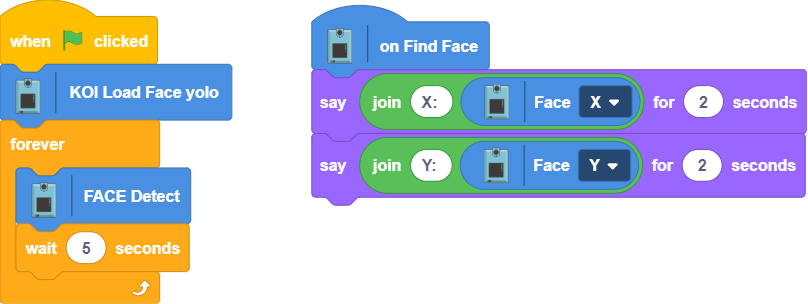

## Geometric Shapes Detection

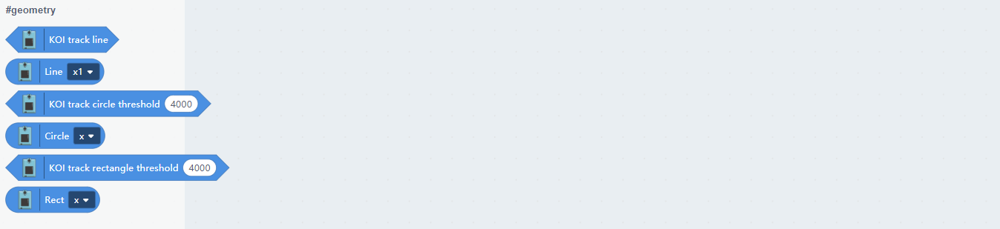

### Sample Program

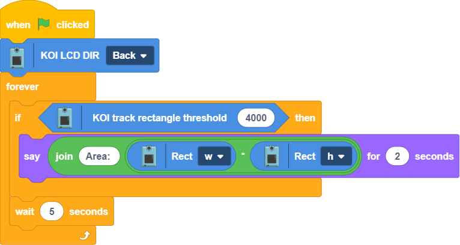

## Color Tracking

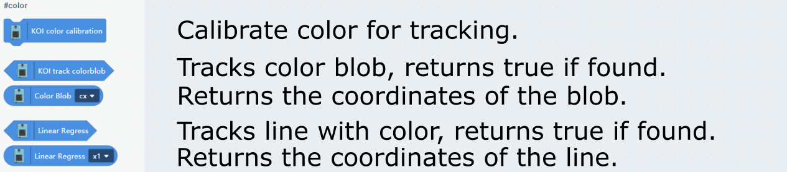

### Sample Program

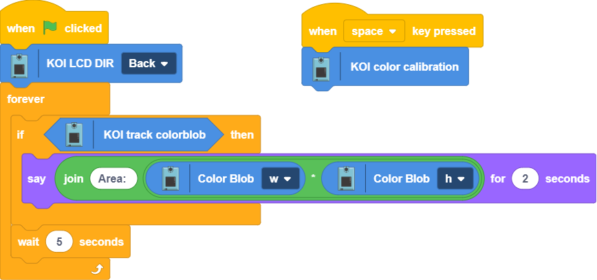

## Barcode and QR code Scanner

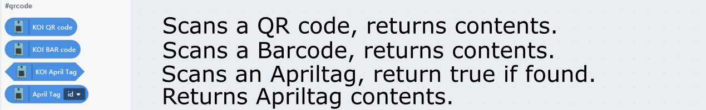

### Sample Program

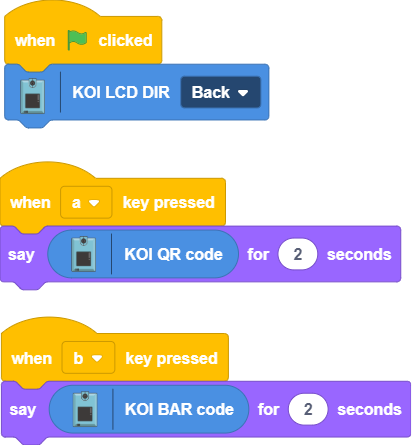

## Voice Recognition

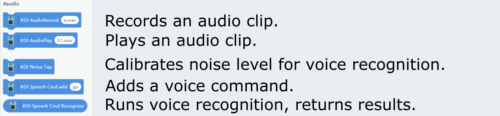

### Sample Program

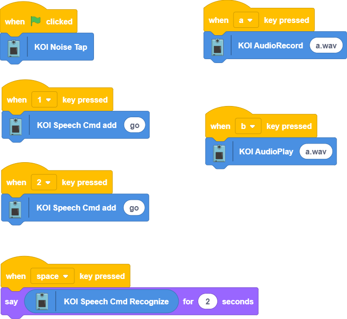

## IOT

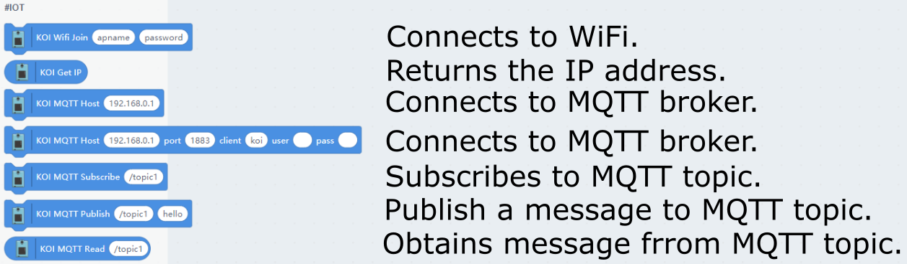

### Sample Program

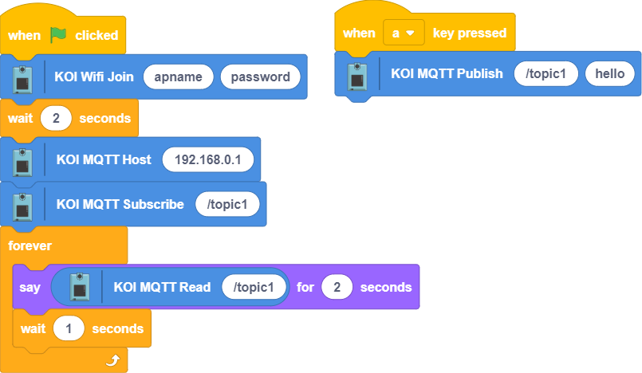

## Face Recognition(Requires Internet Connection)

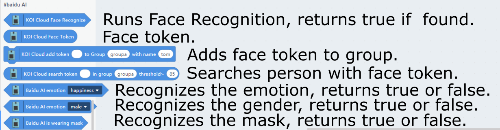

### Sample Program

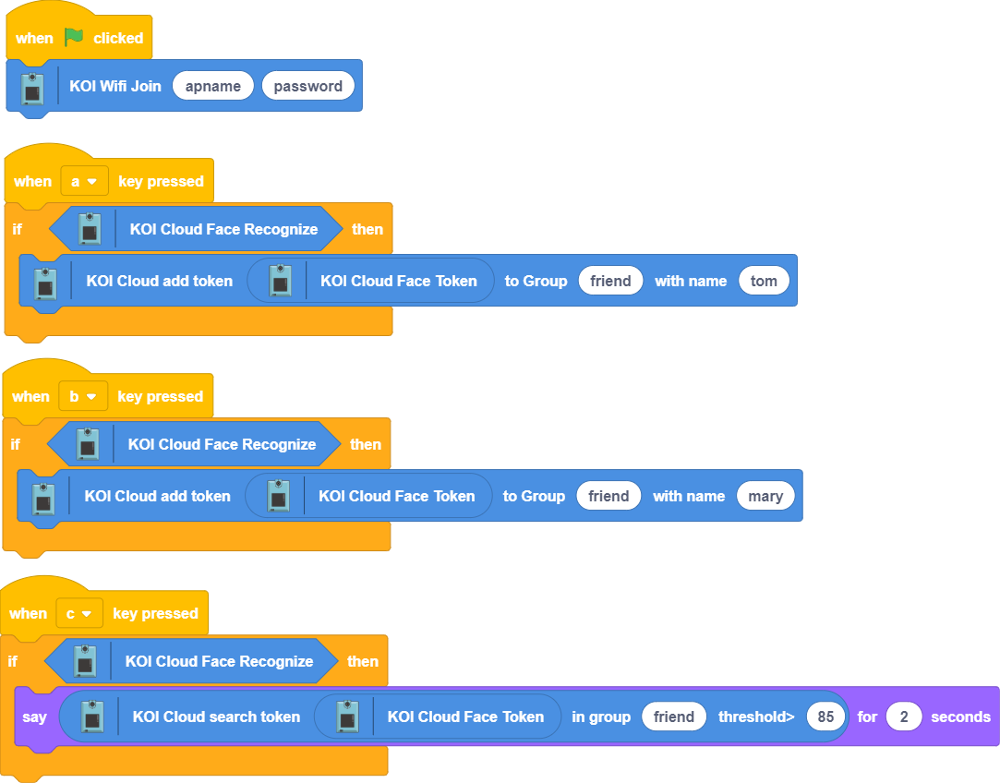

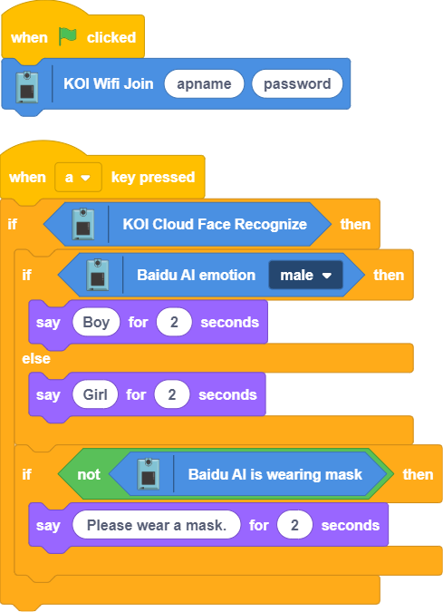

## Troubleshooting

### 1. Clicking on the blocks has no effect after connecting the KOI.

#### The firmware may be outdated, use the firmware update function to undate the firmware.

### 2. Running the image classifier returns an undefined error.

#### The Classifier hasn't been reset, reset the classifier and try again.

### 3. Can I upload the program to run on the KOI?

#### Yes, the KOI will run the main.py on startup.