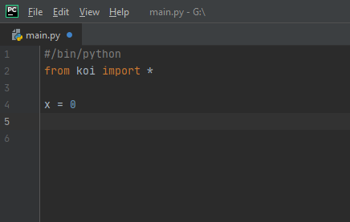
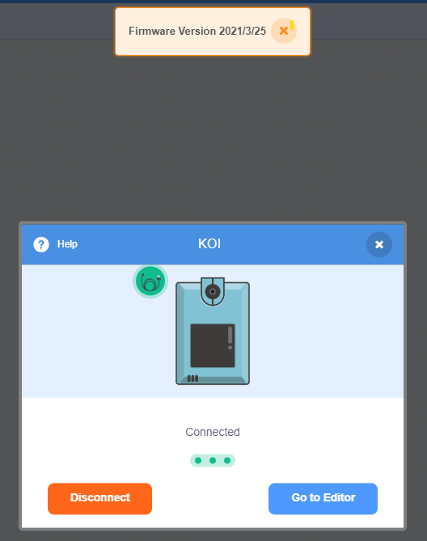
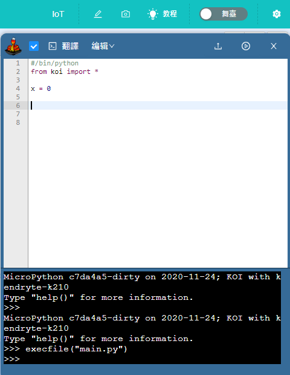
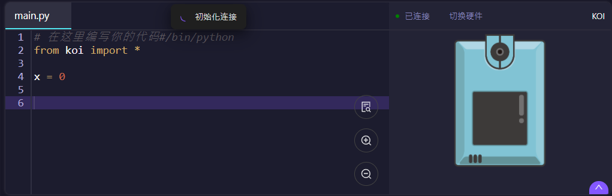
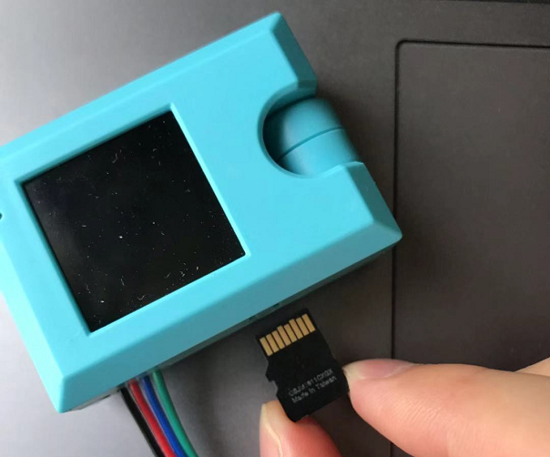
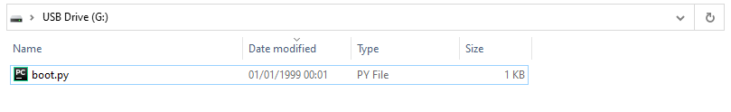

# KOI MicroPython Programming Quickstart

KOI can be programmed using micropython.

## 1. Programming on KittenBlock

### Establish a connection

[Tutorial](../kittenblock/kittenblock)

### 2. Open the Python editor on KittenBlock.

## 2: KittenCode

[Tutorial](../../KittenCode/interface)

## 3: Any Python IDE

### 1. Insert an SD Card into the KOI.

### 2. Open boot.py from the SD Card.

### 2.1 Alternatively, manually add a file called boot.py and add the following code.

    from fpioa_manager import *
    from koi import *
    # bootup comm code

### 3. Add a file called main.py and write code on this file.