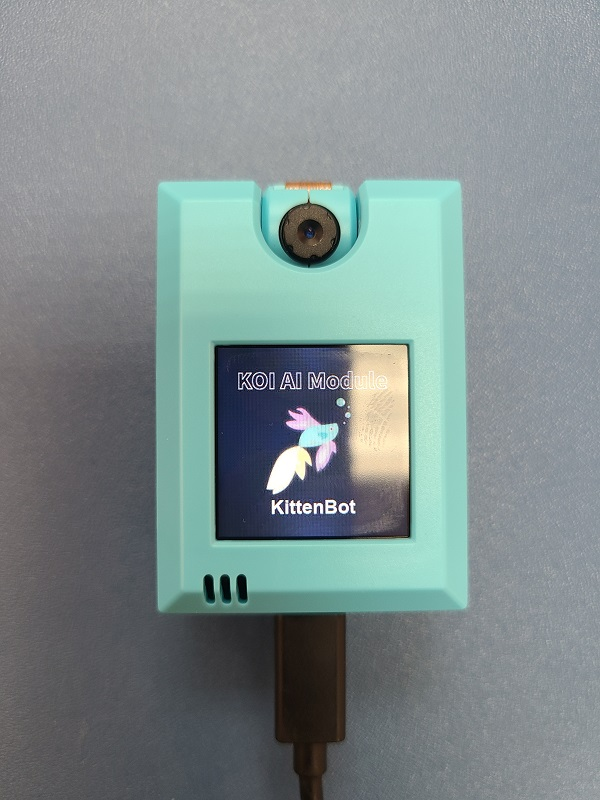
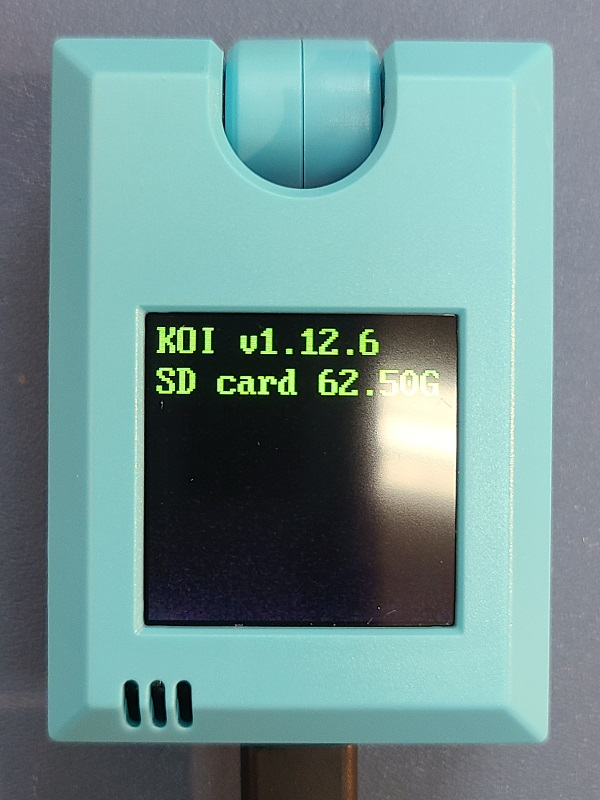
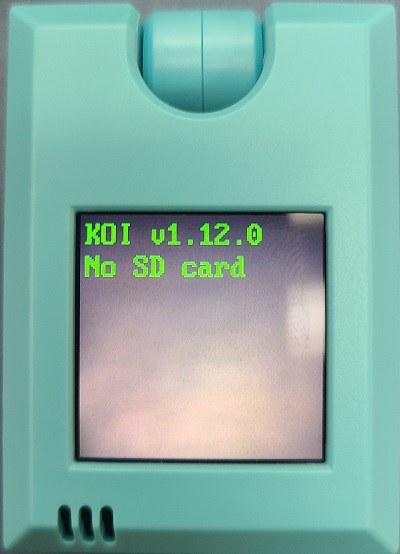
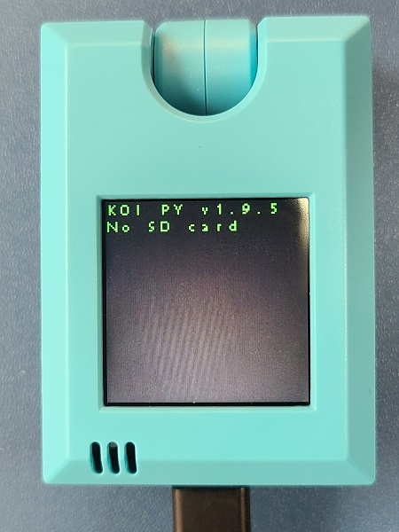
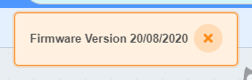

# **KOI Update History**

The latest and legacy firmware files can be downloaded here.

## Latest Firmware(Version: v1.12.6)

Firmware Version: v1.12.6

Release date：20/03/2020

[Firmware Download](http://bit.ly/KOIFW1126)

Update Notes:

1. Improve Stability

Greeting Screen:

Version: 

## Version: v1.12.0

Firmware Version: v1.12.0

Release date: 23/11/2020

[Firmware Download](https://bit.ly/KOIFW1120)

Update Notes:

1. Improve Text-to-Speech stability
2. Face Recognition Improvements
3. Speech Recognition Improvements
4. UI Improvements

Greeting Screen:

Version: 

## Version: v1.9.5

Version: v1.9.5

Release date: 16/09/2020

[Download Link](http://bit.ly/KOIFW195)

Update Notes:

1. IOT Update
2. Voice Recognition Update
3. Increasing tag size from 20 to 40

Greeting Screen:

Version:

## Version: 0.43

Version: 0.43

Relase Date: Before 16/09/2020

[Download Link](http://bit.ly/KOIFW043)

Update Notes:

1. Factory Firmware

Version

## Checking the firmware version

Version is shown when booting up.

Connect to KOI on Kittenblock will cause a pop up showing the firmware version.

