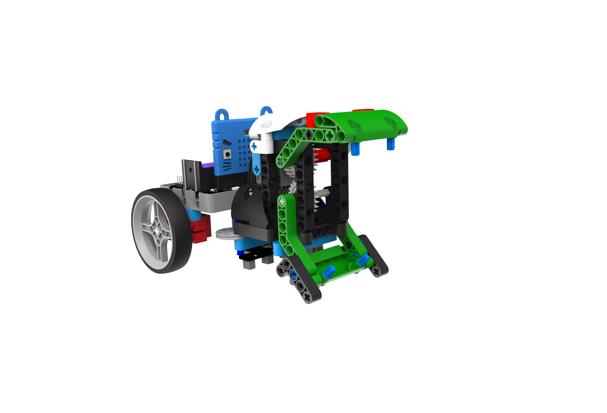
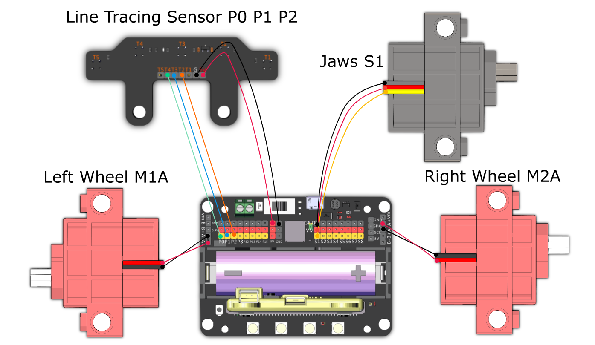

# RoadBlock Smasher

Use the big jaws to build roadblocks in the arena and clear the roadblocks built by the opponent.

## Building Instructions and Sample Programs

[Building Instructions](https://bit.ly/12In1SumobotBuildingInstruction)

[RoadBlock Smasher-JoyFrog Controller](https://makecode.microbit.org/_FDF4x99xf8UH)

[參考程式: 路障剋星-microbit搖控](https://makecode.microbit.org/_gwoa09KhTd1q)

[參考程式: 路障剋星-主體](https://makecode.microbit.org/_MKqcWU0y6WHC)

## Sample Wiring

## Operating the Robot

### JoyFrog Controller:

1. Both the robot and the controller should display 0 when the power is switched no.
2. Use the joystick for movement, press A to close the jaws, press B to open the jaws.
3. Press X to switch to line-following mode.

### Microbit Controller:

1. Both the robot and the controller should display 0 when the power is switched no.
2. Use the accelerometer for movement, press B to close or open the jaws.
3. Press B to switch to line-following mode.