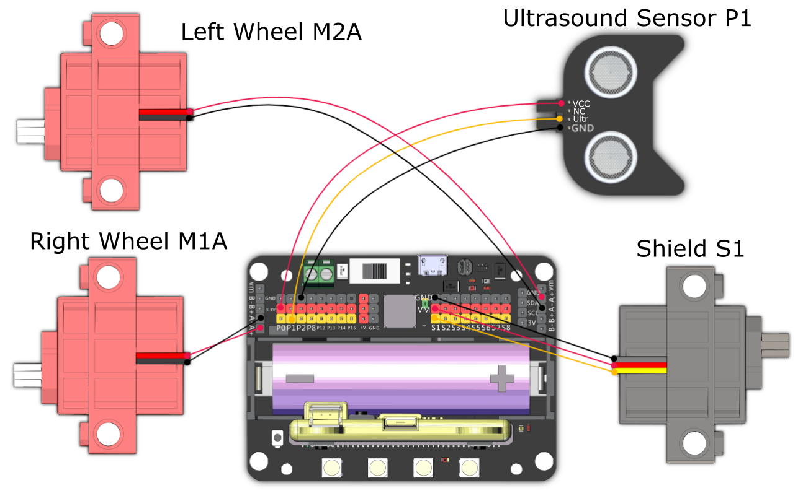

# RoboCatcher

Use the shield to protect the resources from the oppoents, it can also avoid obstacles automatically.

## Building Instructions and Sample Programs

[Building Instructions](https://bit.ly/12In1SumobotBuildingInstruction)

[RoboCatcher-JoyFrog Controller](https://makecode.microbit.org/_EAdieF1Y8Aqm)

[RoboCatcher-Robot(Joyfrog Controller)](https://makecode.microbit.org/_AfqbPTEdMEc8)

[RoboCatcher-Microbit Controller](https://makecode.microbit.org/_25oLsUgq19PK)

[RoboCatcher-Robot(Microbit Controller)](https://makecode.microbit.org/_gLmJRpcdP7Ua)

## Sample Wiring

## Operating the Robot

### JoyFrog Controller:

1. The controller should show a heart icon when the power is switched on.
2. Use the joystick for movement, press A to put down the shield, press B to hold up the shield.
3. Press X to switch to Obstacle Avoiding mode.
4. Press Y to show the distance detected by the ultrasound sensor.

### Microbit Controller:

1. The controller should show a heart icon when the power is switched on.
2. Use the accelerometer for movement, press A to put down the shield and hold up the shield.
3. Press B to switch to Obstacle Avoiding mode.。
