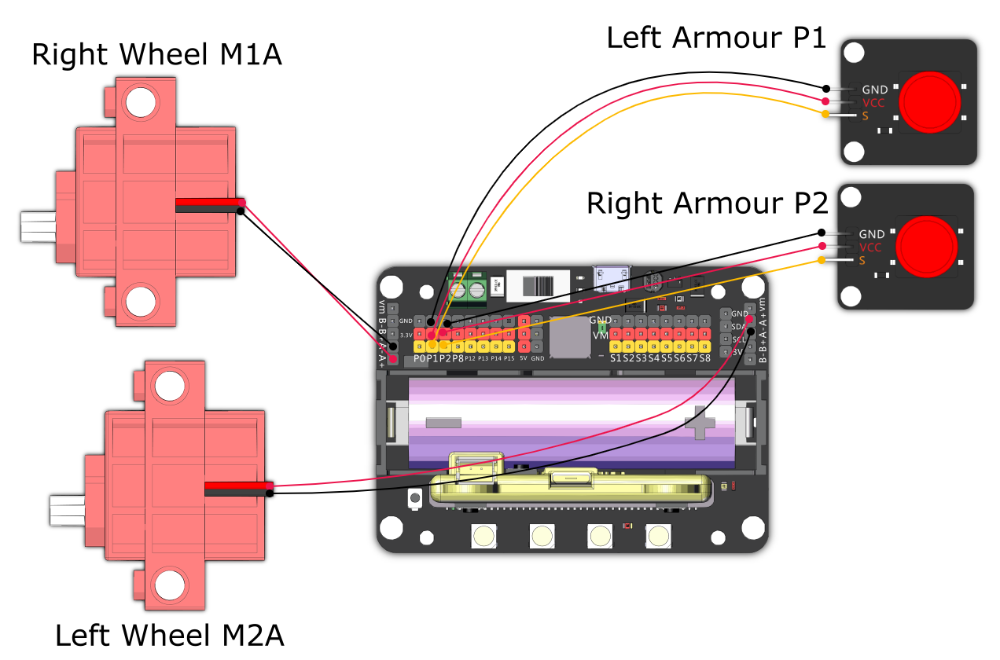

# RoboDino

Use the horn to damage the opponent.

## Building Instructions and Sample Programs

[Building Instructions](https://bit.ly/12In1SumobotBuildingInstruction)

[RoboDino-Joyfrog Controller](https://makecode.microbit.org/_dhce3PKms5Fk)

[RoboDino-Microbit Controller](https://makecode.microbit.org/_J8w7WriE9D4D)

[RoboDino-Robot](https://makecode.microbit.org/_2ixfyk1TAHEh)

## Sample Wiring

## Operating the Robot

### JoyFrog Controller:

1. The robot should show a red light and the controller should show a cross (X) when the power is switched on.
2. Press A to pair with the robot, the Micro:bit should show the current health.
3. Use the joystick for movement.
4. When the armour is hit, the health will be deducted.
5. The player loses when the health reaches 0.

### Microbit控制:

1. The robot should show a red light and the controller should show a cross (X) when the power is switched on.
2. Press A to pair with the robot, the Micro:bit should show the current health.
3. Use the accelerometer for movement.
4. When the armour is hit, the health will be deducted.
5. The player loses when the health reaches 0.

