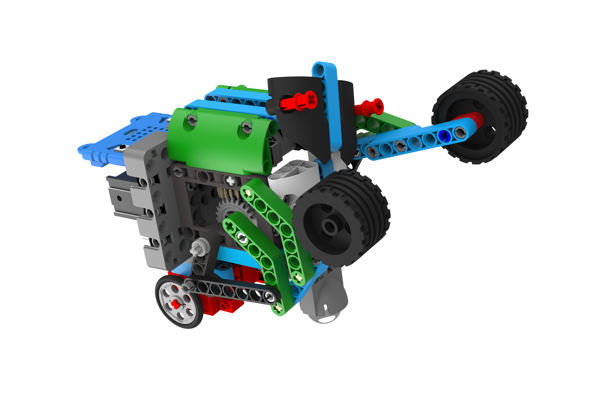
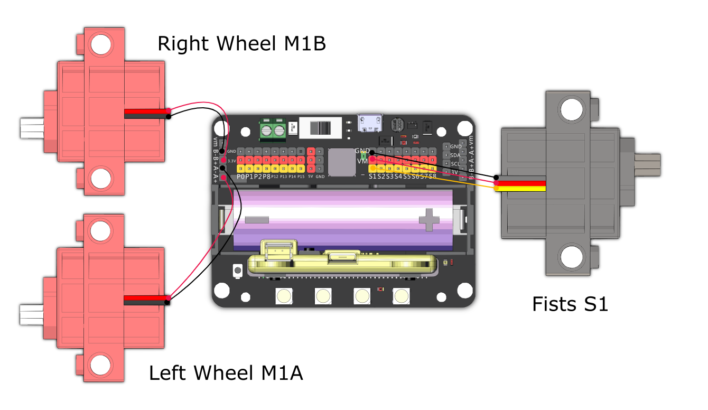

# Punching Mantis

Use the fists to knock down the opponent.

## Building Instructions and Sample Programs

[Building Instructions](https://bit.ly/12In1SumobotBuildingInstruction)

[Punching Mantis-Joyfrog Controller](https://makecode.microbit.org/_awFKYpec2gyz)

[Punching Mantis-Microbit Controller](https://makecode.microbit.org/_KjRD0FD1KUrW)

[Punching Mantis-Robot](https://makecode.microbit.org/_CJE1aggHy2uJ)

## Sample Wiring

## Operating the Robot

### JoyFrog Controller:

1. The robot should show a red light and the controller should show a cross (X) when the power is switched on.
2. Press A to pair the robot, the robot should show a green light upon successful pairing.
3. Use the joystick for movement, press B to attack and B to defend.

### Microbit控制:

1. The robot should show a red light and the controller should show a cross (X) when the power is switched on.
2. Press A to pair the robot, the robot should show a green light upon successful pairing.
3. Use the accelerometer for movement, press B to attack and B to defend.
