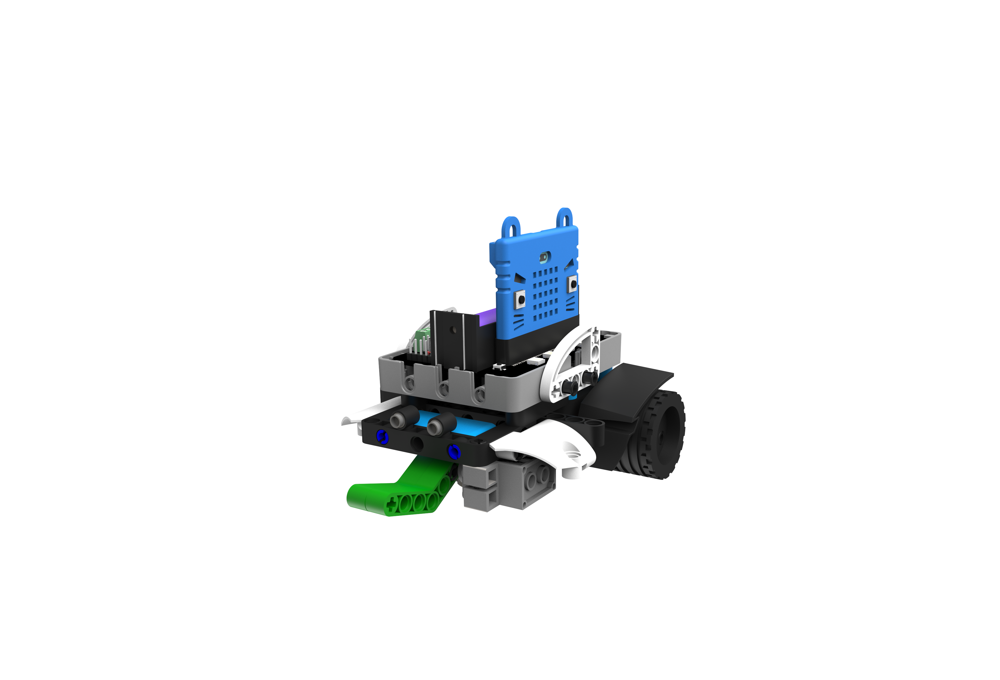
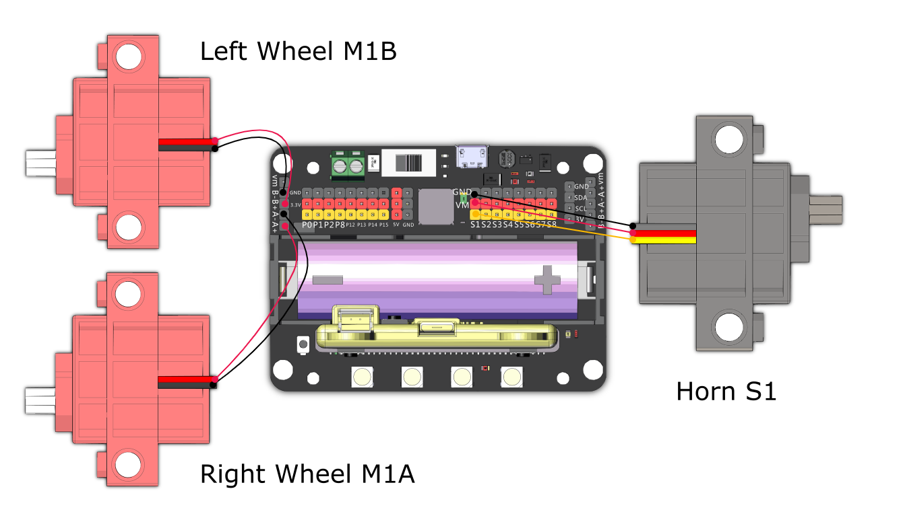

# SumoBot

Attack the opponent using the robot's horn and push it out of the arena, or enter defensive mode to protect your robot from attacks.

## Building Instructions and Sample Programs

[Building Instructions](https://bit.ly/12In1SumobotBuildingInstruction)

Sample Programs:

[SumoBot-JoyFrog Controller](https://makecode.microbit.org/_DEmiTaf1qAz2)

[SumoBot-Microbit Controller](https://makecode.microbit.org/_a3FgJm1dXRka)

[SumoBot-Robot](https://makecode.microbit.org/_FYAD3f49c54q)

## Sample Wiring

## Operating the Robot

### JoyFrog Controller:

1. The robot should show a red light and the controller should show a cross (X) when the power is switched on.
2. Press X to pair the robot, the robot should show a green light upon successful pairing.
3. Use the joystick for movement, press A to attack and B to defend.

### Microbit Controller:

1. The robot should show a red light and the controller should show a cross (X) when the power is switched on.
2. Press A+B to pair the robot, the robot should show a green light upon successful pairing.
3. Use the accelerometer for movement, press A to attack and B to defend.