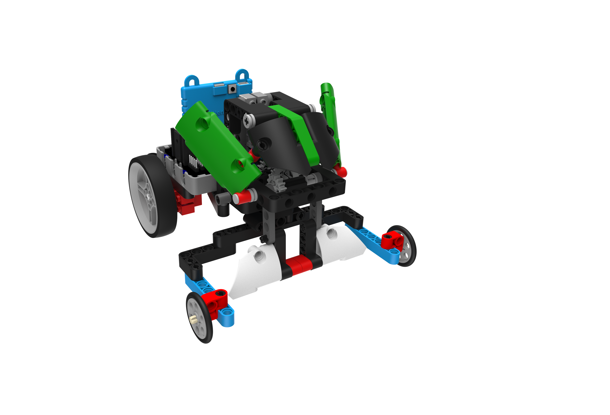
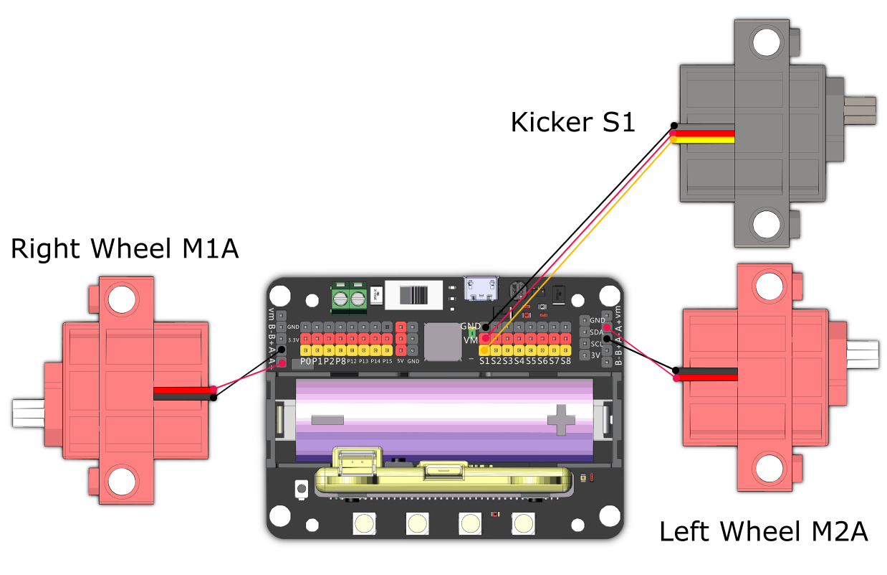

# RoboFootballer

Use its agility to score by kicking the football into the goal.

## Building Instructions and Sample Programs

[Building Instructions](https://bit.ly/12In1SumobotBuildingInstruction)

[RoboFootballer-Joyfrog Controller](https://makecode.microbit.org/_ca7VFifeAhj4)

[RoboFootballer-Microbit Controller](https://makecode.microbit.org/_V2da9FUy6eXy)

[RoboFootballer-Robot](https://makecode.microbit.org/_V99A0ic03X50)

## Sample Wiring

## Operating the Robot

### JoyFrog Controller:

1. The robot should show a red light and the controller should show a cross (X) when the power is switched on.
2. Press A to pair the robot, the robot should show a green light upon successful pairing.
3. Use the joystick for movement.
4. When the moment is right, press B to kick the football.

### Microbit Controller:

1. The robot should show a red light and the controller should show a cross (X) when the power is switched on.
2. Press A to pair the robot, the robot should show a green light upon successful pairing.
3. Use the accelerometer for movement.
4. When the moment is right, press B to kick the football.