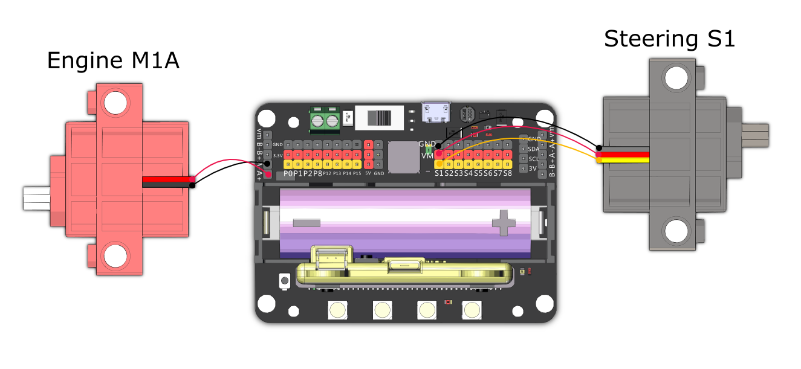

# Speed Racer

This is a robot designed for speed, use your skills to beat the other racers.

## Building Instrutions and Sample Programs

[Building Instructions](https://bit.ly/12In1SumobotBuildingInstruction)

[Speed Racer-Joyfrog Controller](https://makecode.microbit.org/_H0udau4FrYqW)

[Speed Racer-Microbit Controller](https://makecode.microbit.org/_XcR2kH8iqMmY)

[Speed Racer-Robot](https://makecode.microbit.org/_WjWYEHPJJW4c)

## Sample Wire

## Operating the Robot

### JoyFrog Controller:

1. The robot should show a red light and the controller should show a cross (X) when the power is switched on.
2. Press A to pair the robot, the robot should show a green light upon successful pairing.
3. Use the joystick for movement.

### Microbit Controller:

1. The robot should show a red light and the controller should show a cross (X) when the power is switched on.
2. Press A+B to pair the robot, the robot should show a green light upon successful pairing.
3. Use the accelerometer for movement, press A to stop the car, B to lock the steering.