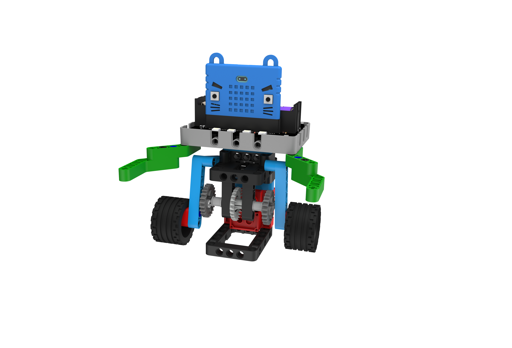
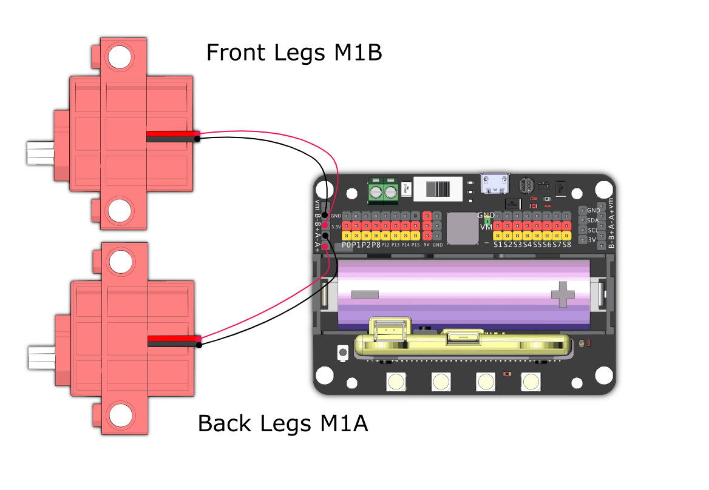

# Sumo Wrestler

Use its huge body and pushing power to push the opponent out of the arena.

## Building Instructions and Sample Programs

[Building Instructions](https://bit.ly/12In1SumobotBuildingInstruction)

[Sumo Wrestler-Joyfrog Controller](https://makecode.microbit.org/_iaaKRmgTP3X7)

[Sumo Wrestler-Microbit Controller](https://makecode.microbit.org/_9fuWMzb4y3bf)

[Sumo Wrestler-Robot](https://makecode.microbit.org/_Jw0F9o94Vb5p)

## Sample Wiring

## Operating the Robot

### JoyFrog Controller:

1. The robot should show a red light and the controller should show a cross (X) when the power is switched on.
2. Press A to pair the robot, the robot should show a green light upon successful pairing.
3. Use the joystick for movement.

### Microbit Controller:

1. The robot should show a red light and the controller should show a cross (X) when the power is switched on.
2. Press A to pair the robot, the robot should show a green light upon successful pairing.
3. Use the accelerometer for movement.