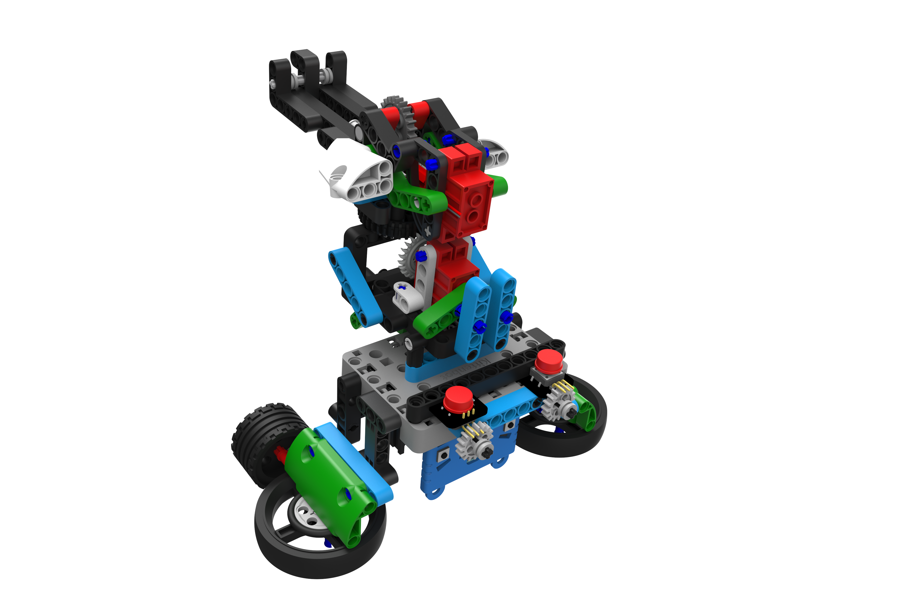
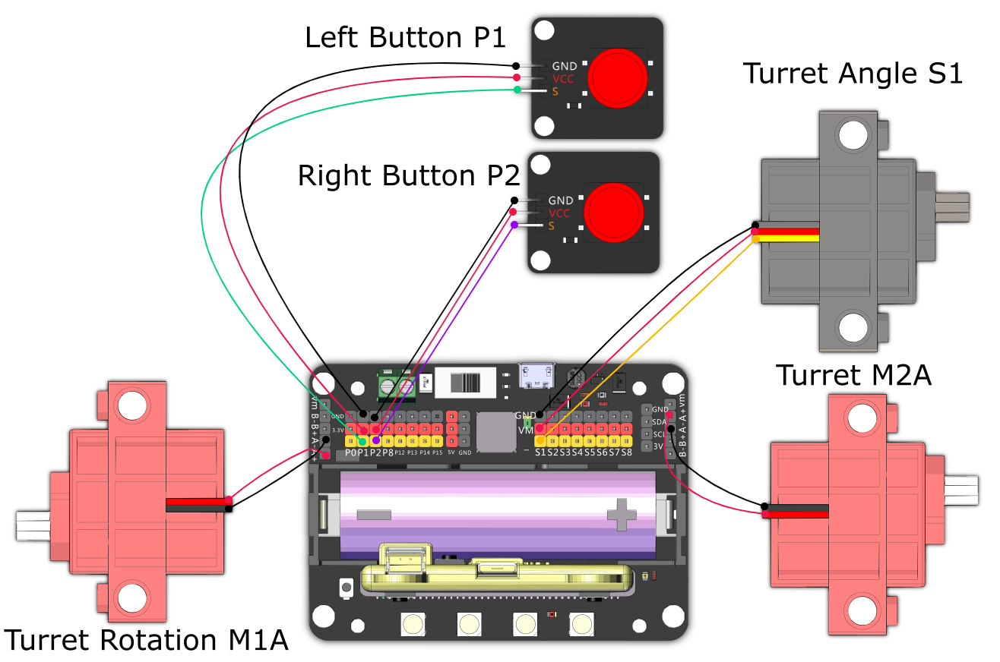

# Battle Turret

A robot capable of long-range artillery, aim and shoot the rubberband to knock the opponents.

## Building Instructions and Sample Program

[Building Instructions](https://bit.ly/12In1SumobotBuildingInstruction)

[attle Turret](https://makecode.microbit.org/_1HuUtRi7rbat)

## Sample Wiring

## Operating the Robot

1. Load rubber bands onto the turret.
2. Use the left button to adjust the firing angle.
3. Press A and B buttons to adjust the rotation.
4. Use the right button to shoot.