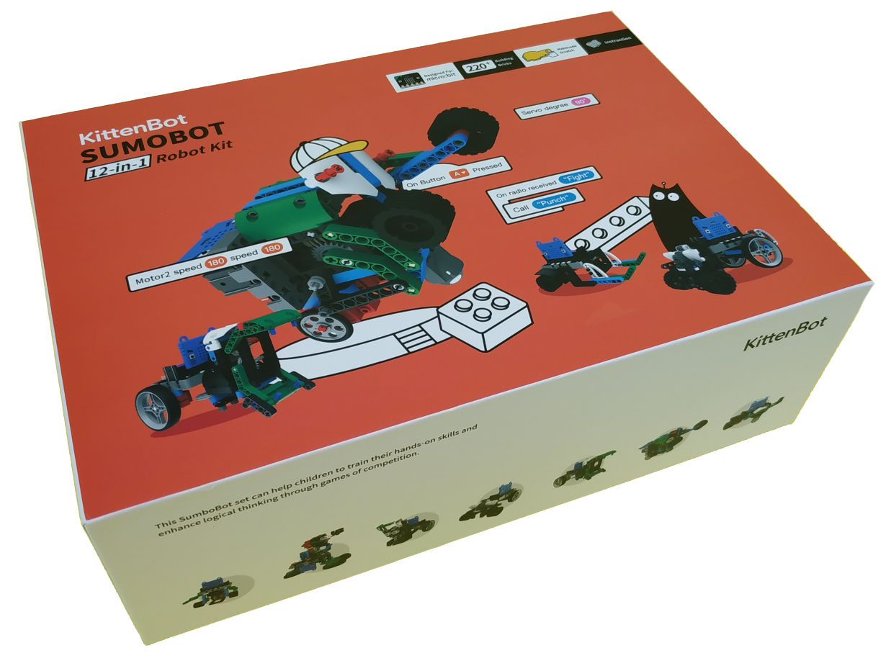
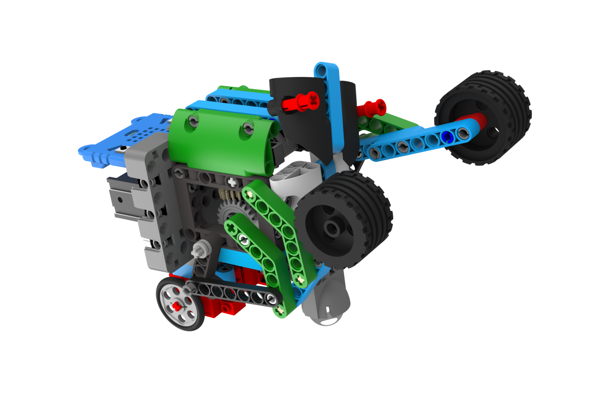
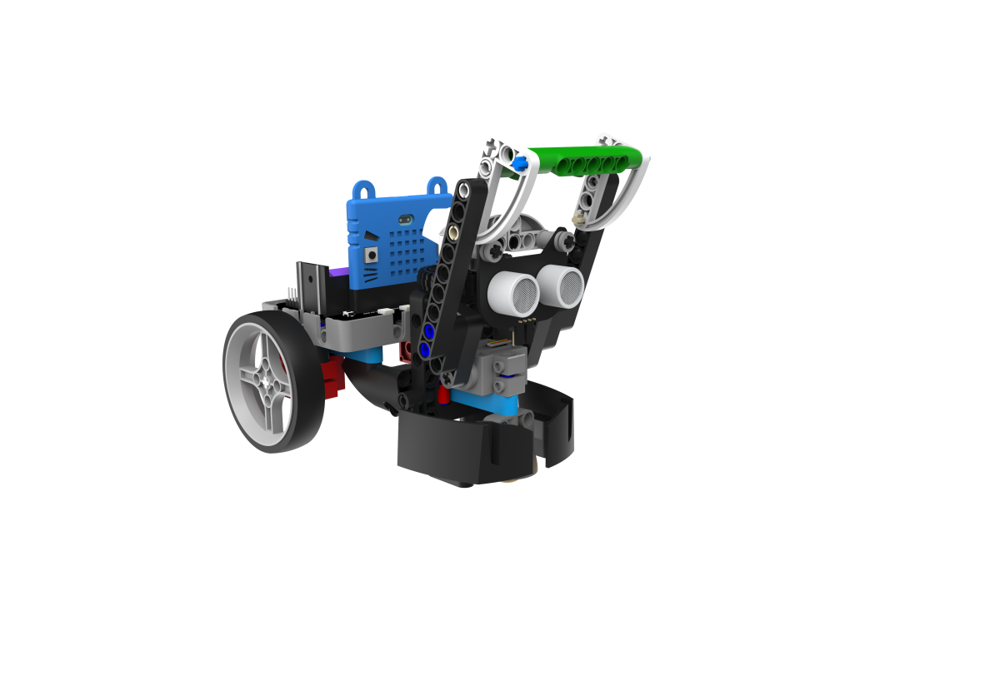
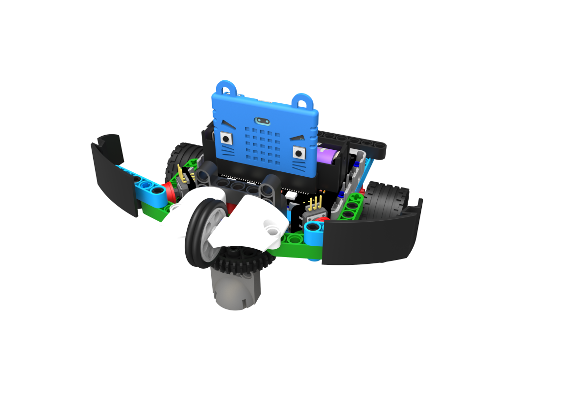
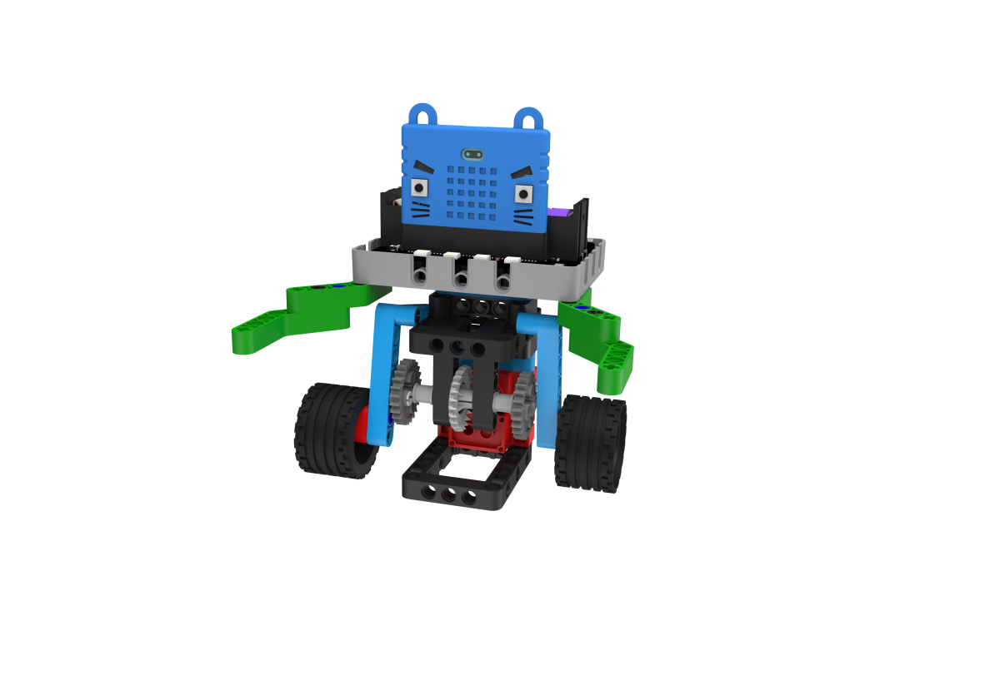
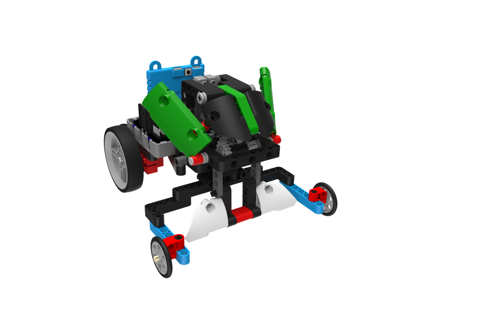
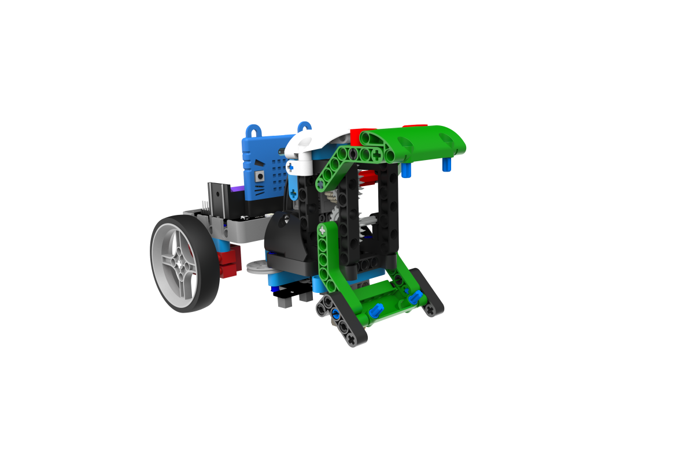
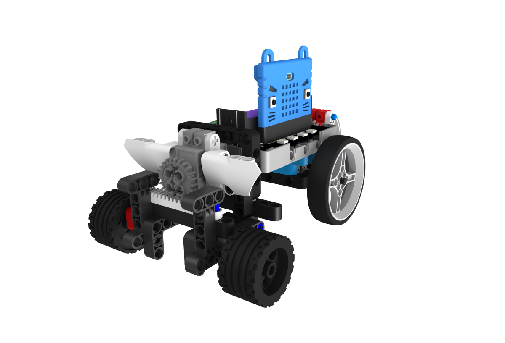
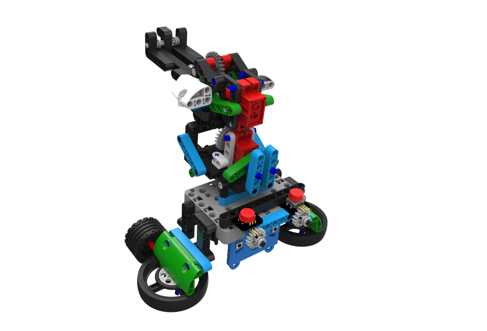
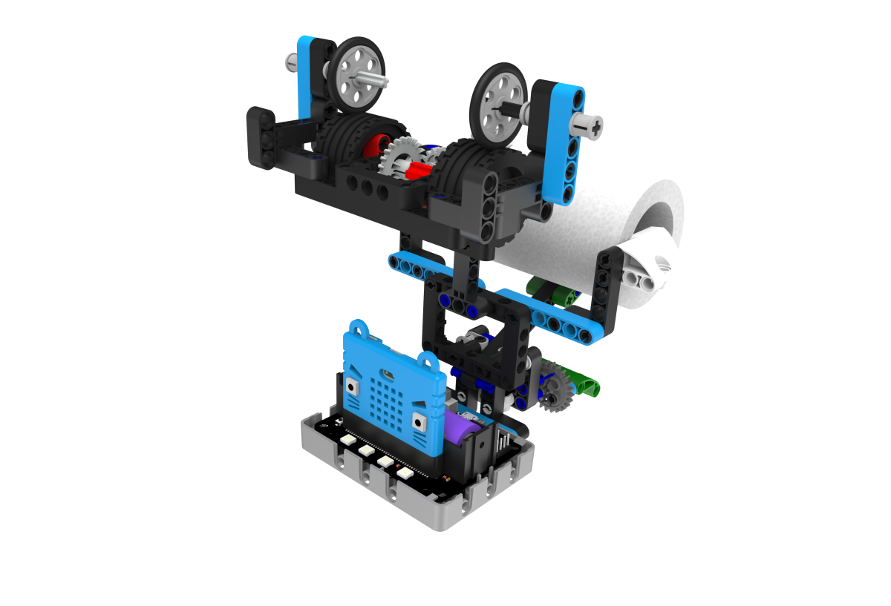

# SumoBot 12-in-1 Kit

SumoBot 12-in-1 Kit(HKBK8017A)

SumoBot 12-in-1 Kit is a competitive play set designed for BBC Micro:bit.

Through building and programming different models, students can engage in competitive games and simultaneously increase their interests in coding and engineering.

## Contents

1. Robotbit Expansion Board x1(Only for Standard Version)
2. 18650 Rechargeable Battery x1(Only for Standard Version)
3. Set of Building Bricks x1
4. 65mm Wheels x2
5. GeekServo 9G Motors x2
6. GeekServo 9G Servo x1
7. Button Modules x2
8. Neko Ultrasound Module x1
9. 5 Way Line Tracing Module x1
10. JoyFrog Controller x1
11. Microbit Battery Box x1
12. Microbit Silicon Jacket x1
13. Pack of Dupont wires x1
14. USB Cable x1

## Features

- Learning by playing

- Allows easy expansion via building bricks

- Easy-to-pick-up programming

- Easy-to-build models

- Designed for Micro:bit

- Compatible with other Kittenbot products

## Specifications

Please refer to: [Robotbit](../../Microbit_eboard/Robotbit/Robotbitfull.md)。

## Demonstration Video

## Models

### 1. SumoBot

Attack the opponent using the robot's horn and push it out of the arena, or enter defensive mode to protect your robot from attacks.

### 2. Flag Swiper

Use the arm to swipe down the flags on the opponent.

### 3. RoboPusher

Make use of its agility to retrieve important resources from the arena.

### 4. Punching Mantis

Use the fists to knock down the opponent.

### 5. RoboCatcher

Use the shield to protect the resources from the oppoents, it can also avoid obstacles automatically.

### 6. RoboDino

Use the horn to damage the opponent.

### 7. Sumo Wrestler

Use its huge body and pushing power to push the opponent out of the arena.

### 8. RoboFootballer

Use its agility to score by kicking the football into the goal.

### 9. RoadBlock Smasher

Use the big jaws to build roadblocks in the arena and clear the roadblocks built by the opponent.

### 10. Speed Racer

This is a robot designed for speed, use your skills to beat the other racers.

### 11. Battle Turret

A robot capable of long-range artillery, aim and shoot the rubberband to knock the opponents.

### 12. Smart Toilet Tissue Machine

Gives you toilet tissue automatically.

