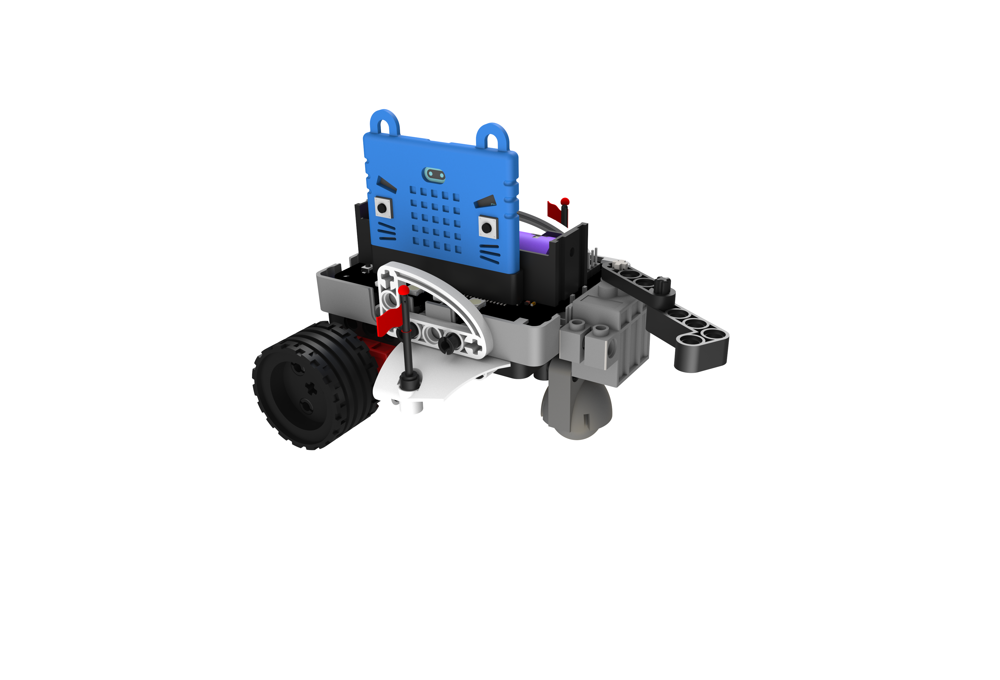
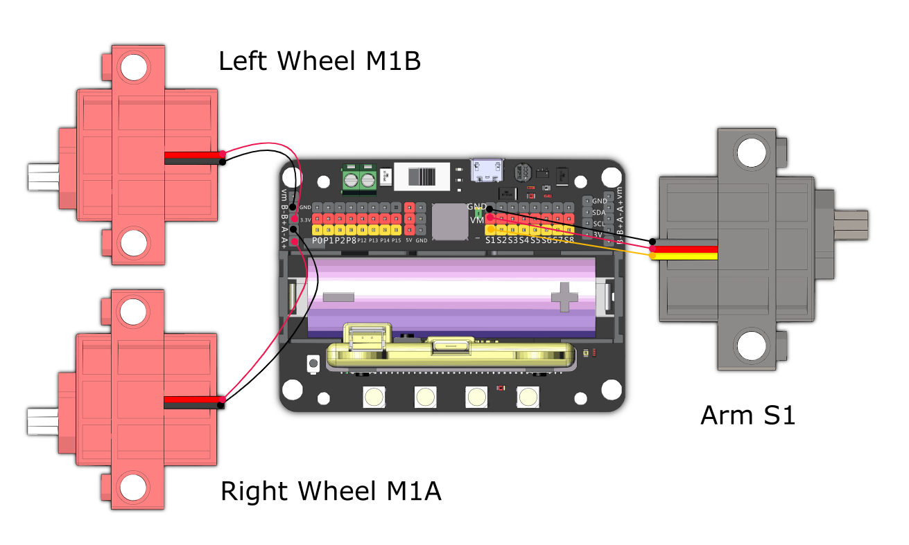

# Flag Swiper

Use the arm to swipe down the flags on the opponent.

## Building Instructions and Sample Programs

[Building Instructions:](https://bit.ly/12In1SumobotBuildingInstruction)

Sample Programs:

[Flag Swiper-JoyFrog Controller](https://makecode.microbit.org/_bUuFeEW83CEt)

[Flag Swiper-Microbit Controller](https://makecode.microbit.org/_6ugdUsWaPddw)

[Flag Swiper-Robot](https://makecode.microbit.org/_b5cWwihAv7WX)

## Sample Wiring

## Operating the Robot

### JoyFrog Controller:

1. The robot should show a red light and the controller should show a cross (X) when the power is switched on.
2. Press X to pair the robot, the robot should show a green light upon successful pairing.
3. Use the joystick for movement, A and B buttons for swiping left and right.

### Microbit控制:

1. The robot should show a red light and the controller should show a cross (X) when the power is switched on.
2. Press A+B to pair the robot, the robot should show a green light upon successful pairing.
3. Use the accelerometer for movement, A and B buttons for swiping left and right.