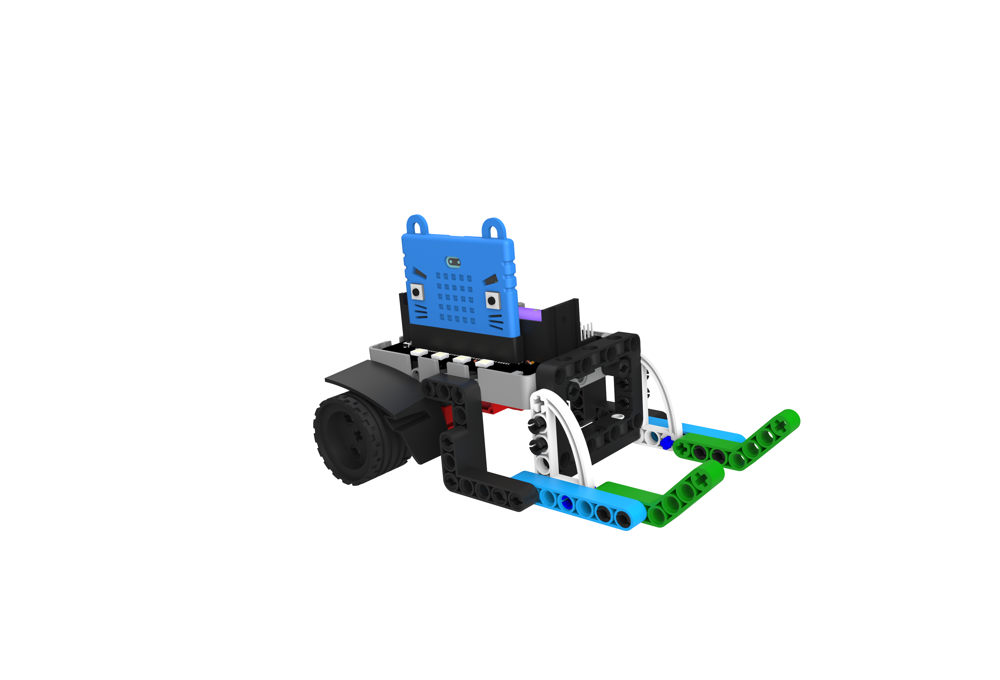
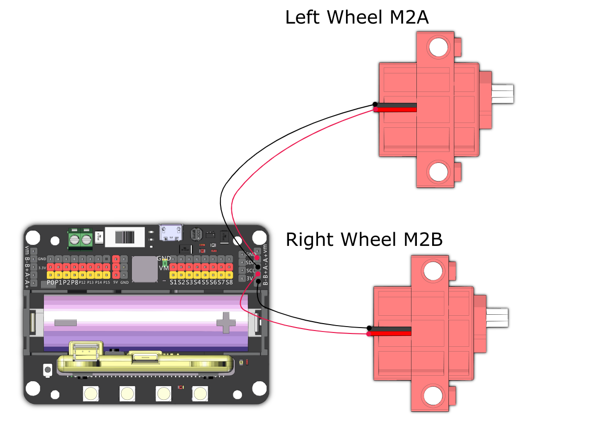

# RoboPusher

Make use of its agility to retrieve important resources from the arena.

## Building Instructions and Sample Programs

[Building Instructions](https://bit.ly/12In1SumobotBuildingInstruction)

Sample Programs: 

[RoboPusher-JoyFrog Controller](https://makecode.microbit.org/_Rrh8fsVpUb17)

[RoboPusher-Microbit Controller](https://makecode.microbit.org/_diEUaYgt1Dhc)

[RoboPusher-Robot](https://makecode.microbit.org/_KpUhpri1K8za)

## Sample Wiring

## Operating the Robot

### JoyFrog Controller:

1. The robot should show a red light and the controller should show a cross (X) when the power is switched on.
2. Press X to pair the robot, the robot should show a green light upon successful pairing.
3. Use the joystick for movement.

### Microbit Controller:

1. The robot should show a red light and the controller should show a cross (X) when the power is switched on.
2. Press A+B to pair the robot, the robot should show a green light upon successful pairing.
3. Use the accelerometer for movement.