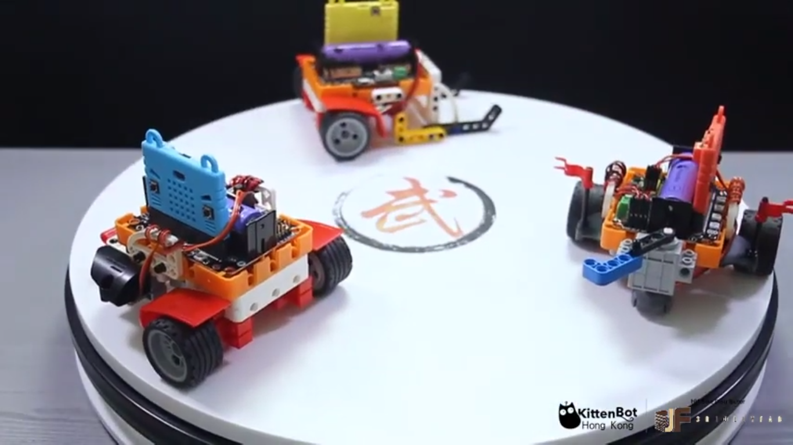

# MR STEMER 3-in-1 BattleBots Kit

MR STEMER 3-in-1 BattleBots Kit(HKBK6001A)

MR STEMER 3-in-1 BattleBots Kit is a competitive play set designed for BBC Micro:bit.

Through building and programming different models, students can engage in competitive games and simultaneously increase their interests in coding and engineering.

## Contents

1. Robotbit Expansion Board x1(Only for Standard Version)
2. 18650 Rechargeable Battery x1(Only for Standard Version)
3. Set of Building Bricks x1
4. 65mm Wheels x2
5. GeekServo 9G Motors x2
6. GeekServo 9G Servo x1
10. JoyFrog Controller x1
11. Microbit Battery Box x1
12. Microbit Silicon Jacket x1
14. USB Cable x1

## Features

- Learning by playing

- Allows easy expansion via building bricks

- Easy-to-pick-up programming

- Easy-to-build models

- Designed for Micro:bit

- Compatible with other Kittenbot products

## Specifications

Please refer to: [Robotbit](../../Microbit_eboard/Robotbit/Robotbitfull.md)。

## Demonstration Video

## Models

### 1. SumoBot

Attack the opponent using the robot's horn and push it out of the arena, or enter defensive mode to protect your robot from attacks.

### 2. Flag Swiper

Use the arm to swipe down the flags on the opponent.

### 3. RoboPusher

Make use of its agility to retrieve important resources from the arena.

