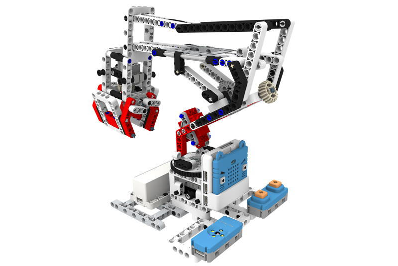
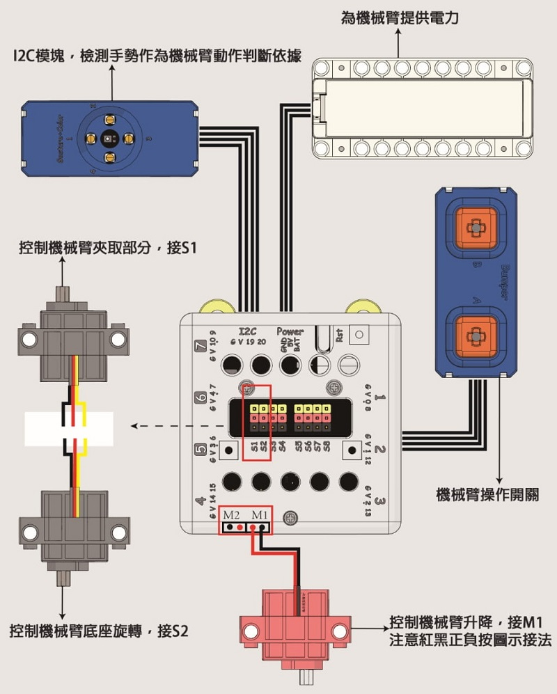
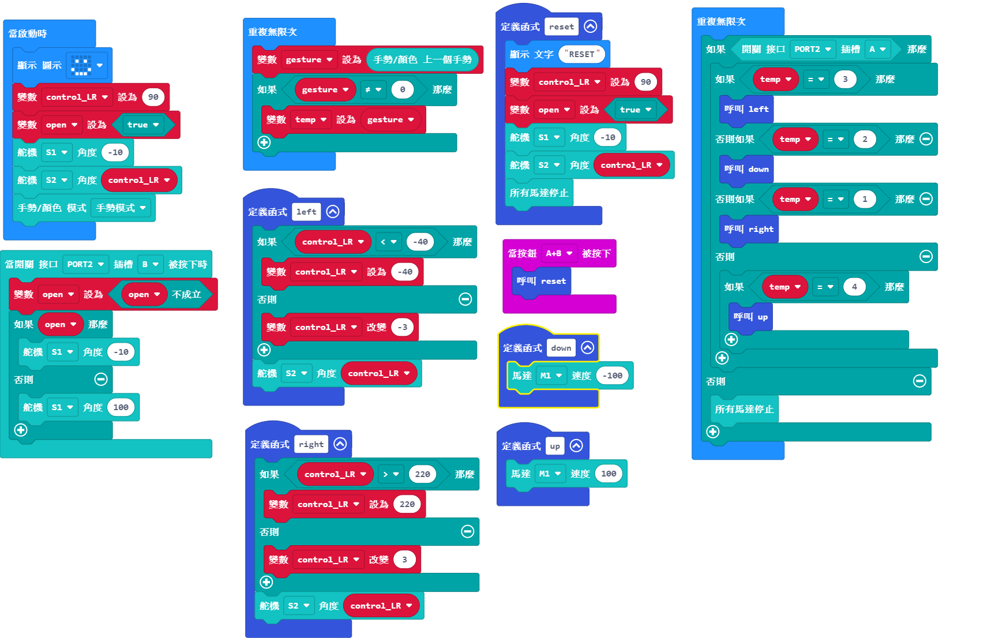

# Gestured Controlled Crane

## Instructions Resource Pack

[Download](https://bit.ly/Powerbrick10in1BuildingGuide)

## Sample Wiring

## Sample Programs Resource Pack

[Download](https://bit.ly/Powerbrick10in1ModelsHex)

## Model Instructions

This is a model crane which can pick up items with its claws.

Your finger directions will determine the crane's actions.

Swipe up or down and then press A, this will make the crane extend or retract.

Swipe left or right and then press A, this will make the crane rotate left or right.

Press B to close or open the claws.
