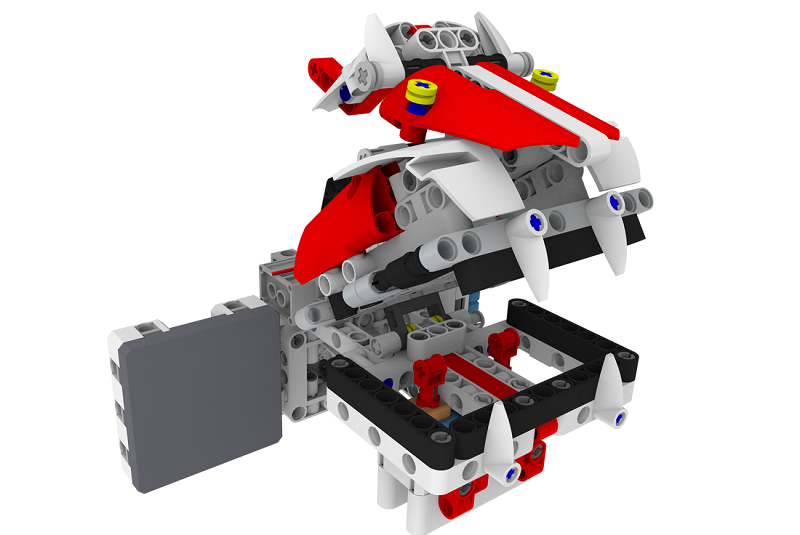
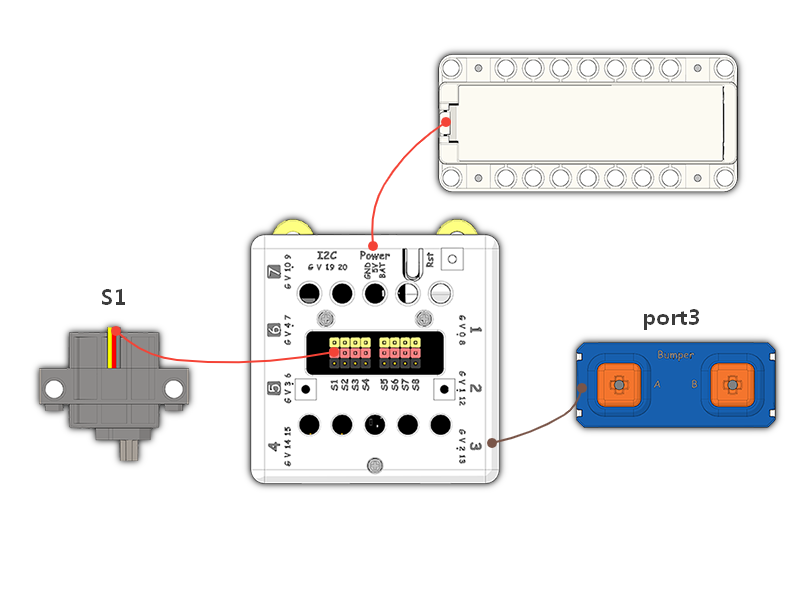
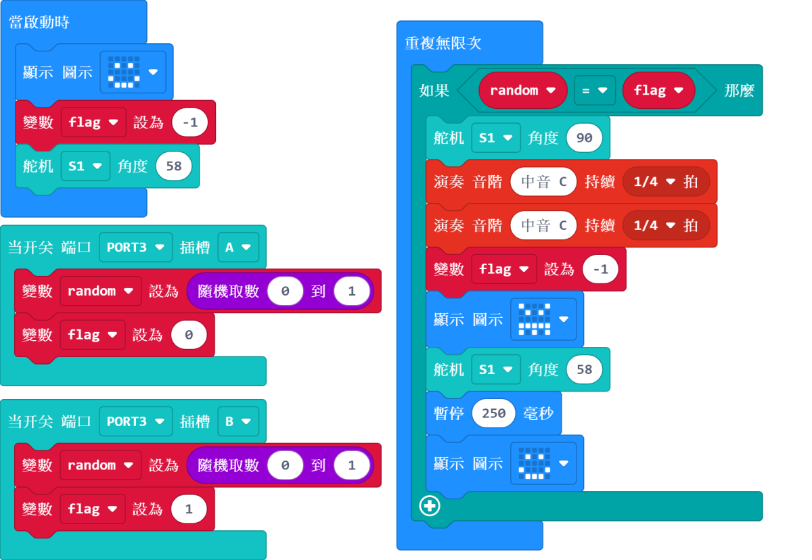

# Chomping Duck

## Instructions Resource Pack

[Download](https://bit.ly/Powerbrick10in1BuildingGuide)

## Sample Wiring

## Sample Programs Resource Pack

[Download](https://bit.ly/Powerbrick10in1ModelsHex)

## Model Instructions

This is a game of luck.

Put your fingers inside the duck's mouth and press either the left or right button, you will be chomped if you are unfortunate.
