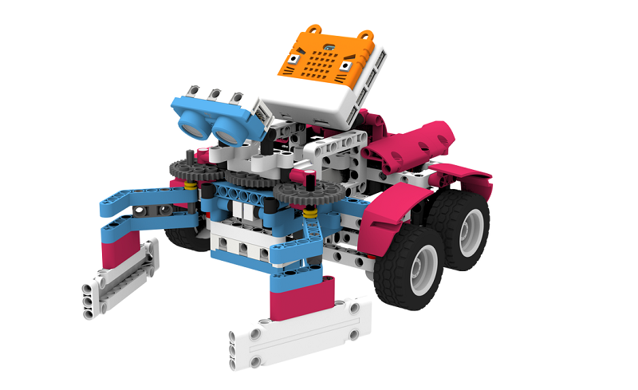
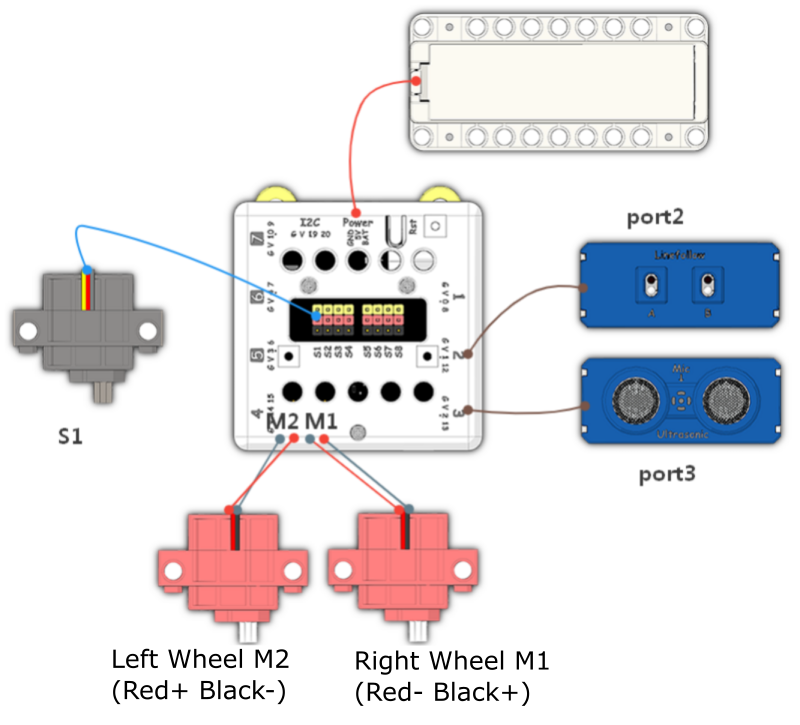
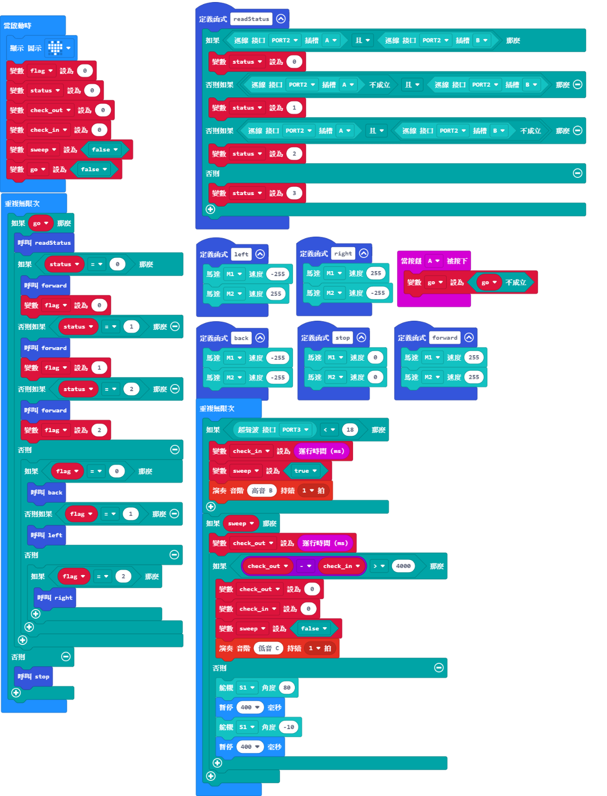

# Line Follow Street Cleaning Car

## Instructions Resource Pack

[Download](https://bit.ly/Powerbrick10in1BuildingGuide)

## Sample Wiring

## Sample Programs Resource Pack

[Download](https://bit.ly/Powerbrick10in1ModelsHex)

## Model Instructions

This is an automatic street cleaning car.

Place the model on a black line and press A, the car will move along the black line.

The model will sweep away litter if any has been found.
