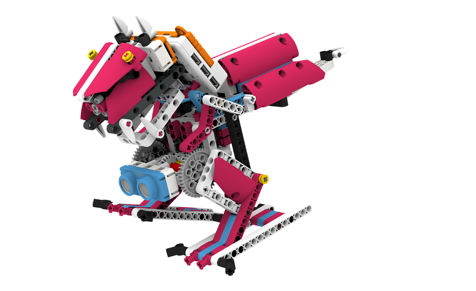
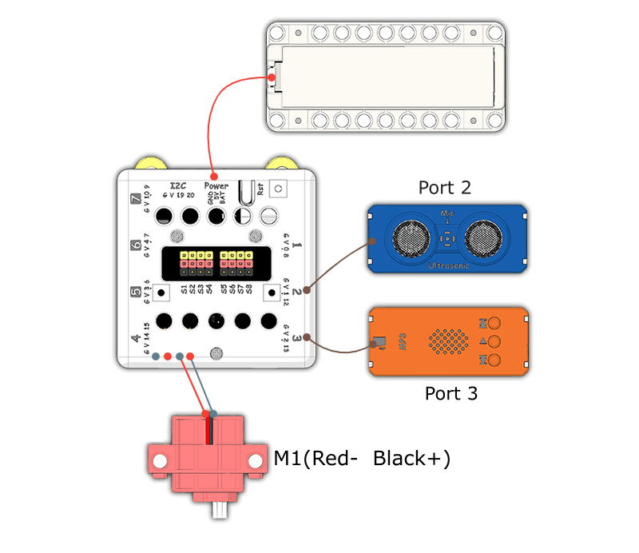
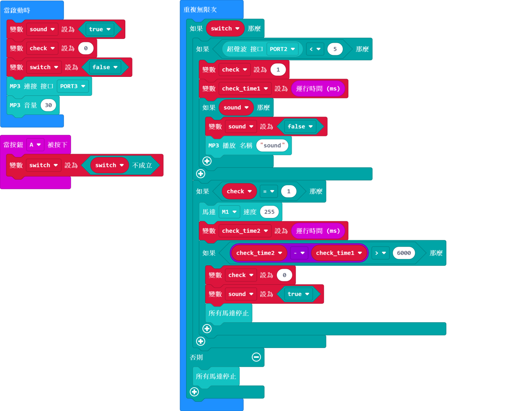

# Dino King

## Instructions Resource Pack

[Download](https://bit.ly/Powerbrick10in1BuildingGuide)

## Sample Wiring

## Sample Programs Resource Pack

[Download](https://bit.ly/Powerbrick10in1ModelsHex)

**Put the sound files onto a microSD card(not included) and insert it into the MP3 module.**

## Model Instructions

This is a walking dinosaur.

The dinosaur will walk forward for a few steps upon pressing A.

It can also roar if an obstacle has been detected.
