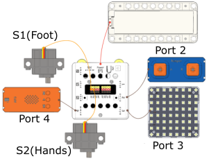
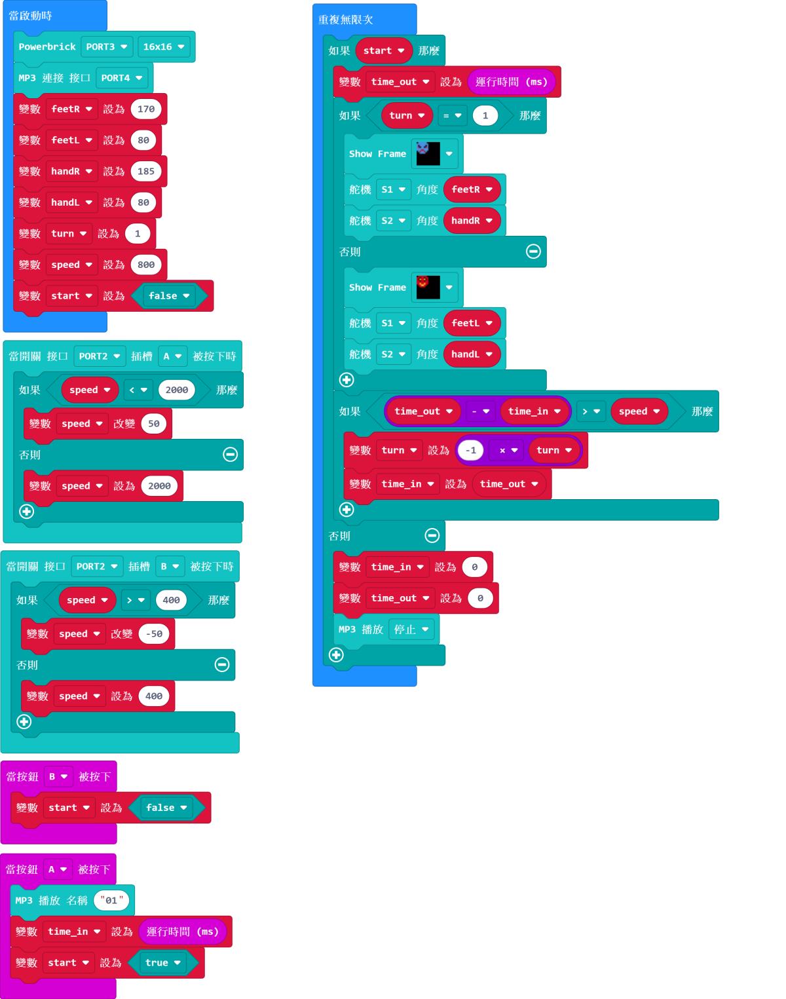

# Robo Dancer

## Instructions Resource Pack

[Download](https://bit.ly/Powerbrick10in1BuildingGuide)

## Sample Wiring

## Sample Programs Resource Pack

[Download](https://bit.ly/Powerbrick10in1ModelsHex)

**Put the sound files onto a microSD card(not included) and insert it into the MP3 module.**

    "Flying Kerfuffle" Kevin MacLeod (incompetech.com)
    Licensed under Creative Commons: By Attribution 4.0 License
    http://creativecommons.org/licenses/by/4.0/

## Model Instructions

This little robot will dance to the music.

Press A or B on the Micro:bit to start or stop the music.

Pressing A or B on the button module changes the robot's speed.
