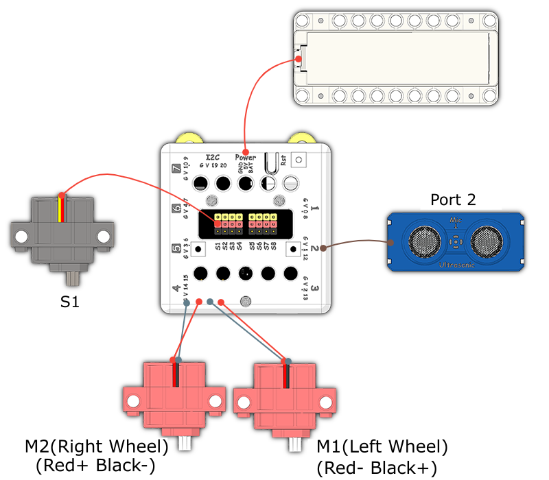
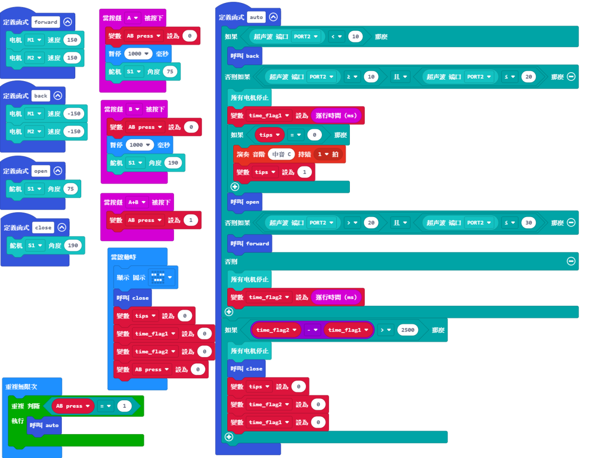

# Smart Bin

## Instructions Resource Pack

[Download](https://bit.ly/Powerbrick10in1BuildingGuide)

## Sample Wiring

## Sample Programs Resource Pack

[Download](https://bit.ly/Powerbrick10in1ModelsHex)

## Model Instructions

This is a smart trash bin.

Press A and B simultaneously to enter automatic mode.

In automatic mode, you can control the model in these ways:

- Push the bin away from you by placing your hand in the 0~10 cm range.
  
- The bin cover can be opened by placing your hand in the 10~20 cm range.

- Pull the bin towards you by placing your hand in the 20~30 cm range.

Press A or B to manually control the bin cover.
