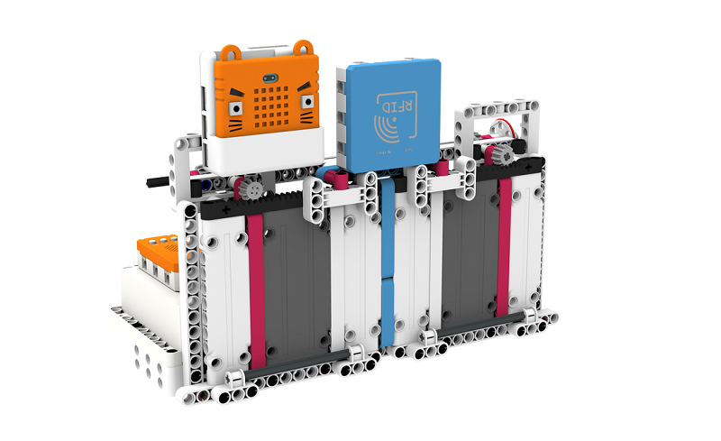
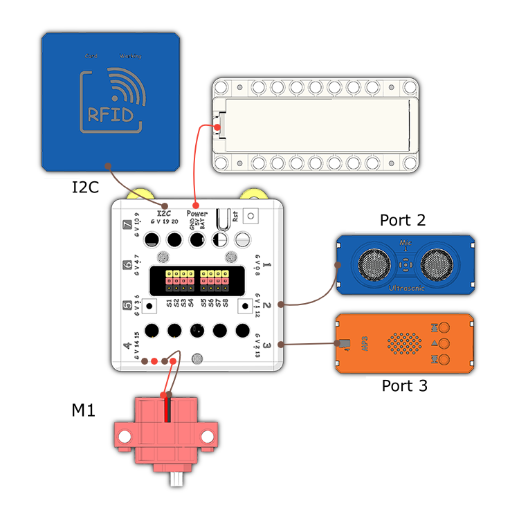
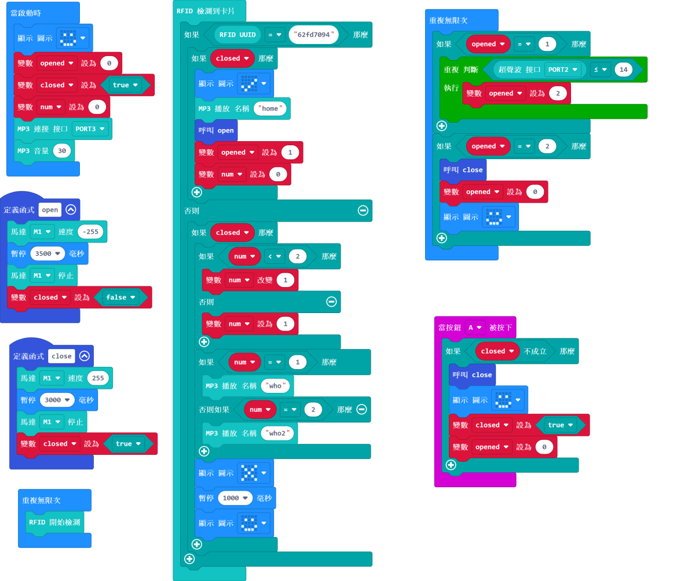

# Smart Gate

## Instructions Resource Pack

[Download](https://bit.ly/Powerbrick10in1BuildingGuide)

## Sample Wiring

## Sample Programs Resource Pack

[Download](https://bit.ly/Powerbrick10in1ModelsHex)

**Put the sound files onto a microSD card(not included) and insert it into the MP3 module.**

    Fill in your own UUID in the program.

## Model Instructions

This is a smart gate.

Put the RFID Card onto the reader, you will be granted entry if the UUID matches.