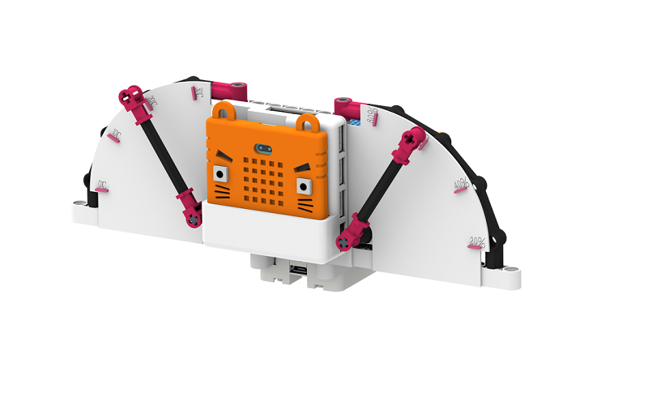
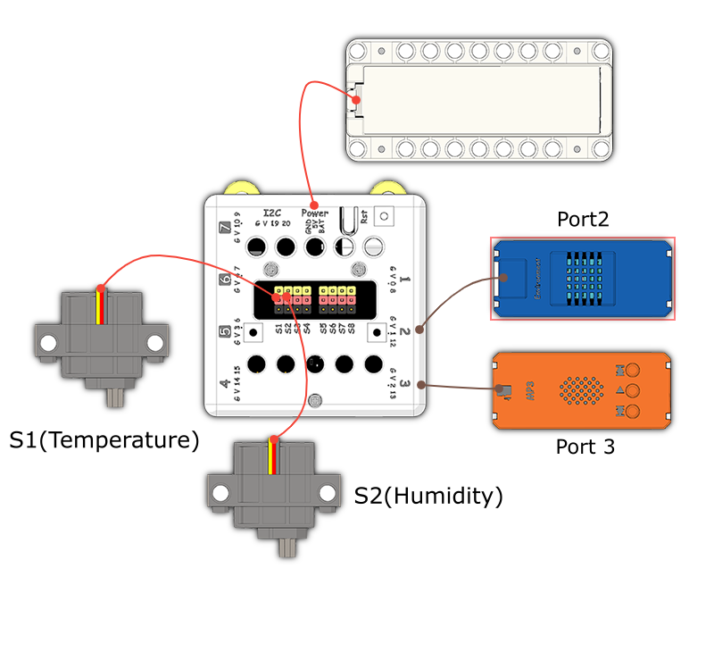

# Weather Reporter

## Instructions Resource Pack

[Download](https://bit.ly/Powerbrick10in1BuildingGuide)

## Sample Wiring

## Sample Programs Resource Pack

[Download](https://bit.ly/Powerbrick10in1ModelsHex)

**Put the sound files onto a microSD card(not included) and insert it into the MP3 module.**

## Model Instructions

This weather reporter monitors the temperature and humidity in the environment.

Press A to tell the temperature, press B to tell the humidity.
