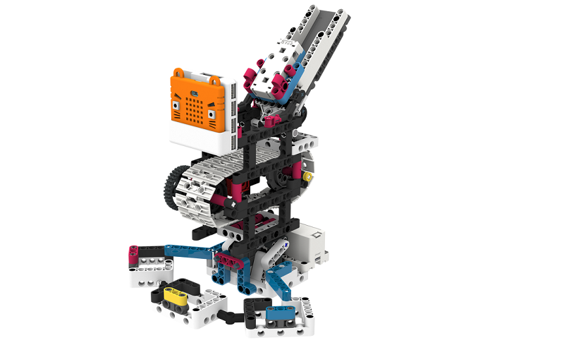
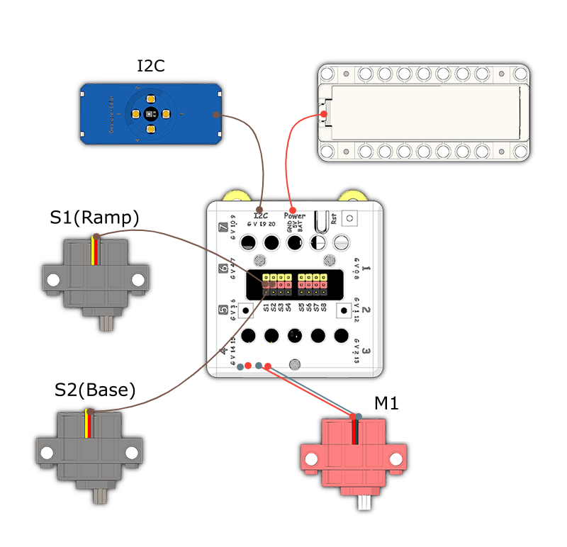
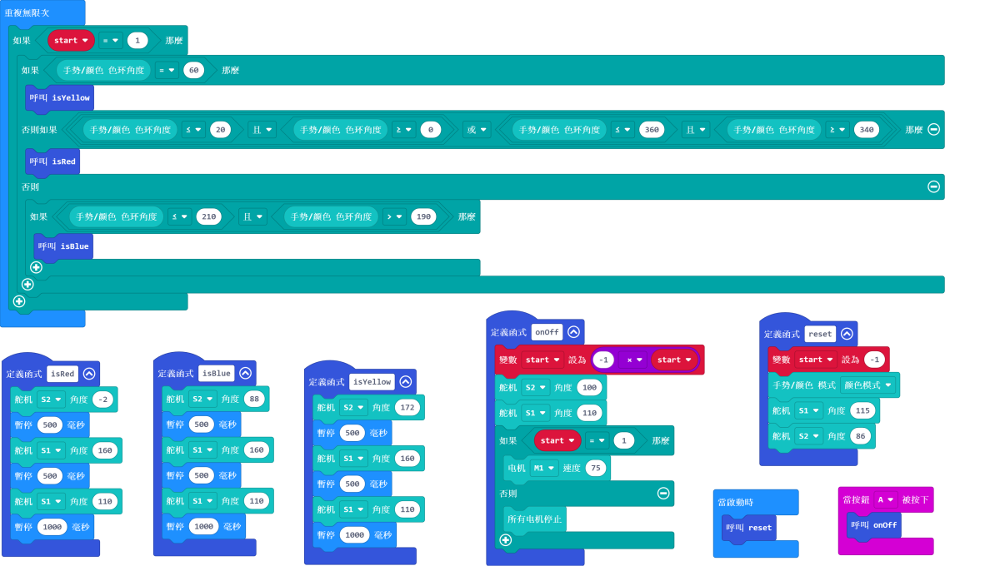

# Brick Sorter

## Instructions Resource Pack

[Download](https://bit.ly/Powerbrick10in1BuildingGuide)

## Sample Wiring

## Sample Programs Resource Pack

[Download](https://bit.ly/Powerbrick10in1ModelsHex)

## Model Instructions

This machine is able to sort plastic bricks by 3 colors: red, yellow and blue.

Place the colored bricks onto the ramp.

The bricks will be transported to the corresponding basket.
