# PowerBrick All-In-One

PowerBrick(without Building Blocks) (HKBK8038A)

PowerBrick(with Building Blocks) (HKBK8039B)

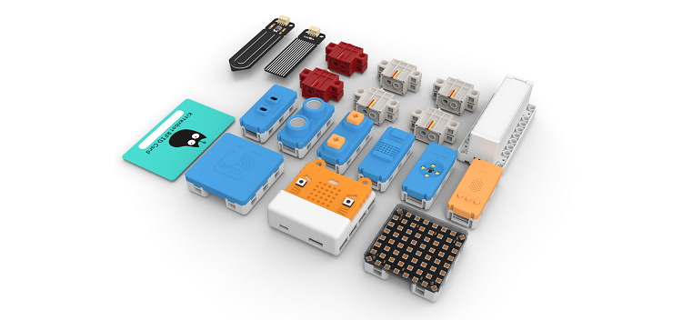

PowerBrick All-In-One is an educational kit set designed by Kittenbot for BBC Micro:bit.

This kit comes with many sensors and actuators, enabling primary and secondary school students to easily learn coding and develop their makerism.

## Background Information

Most schools in Hong Kong use the BBC Micro:bit for STEM education, since the Micro:bit combines various components onto a small convenient package.

However the BBC Micro:bit has shortcomings in terms of its edge connectors, teachers and students find that these connectors are annoying and troublesome to use. Problems such as loose connection and incorrect wiring are frequent, reducing efficiency in teaching and learning.

The exposed circuit boards present another problems where components can be damaged or short-circuited.

Instead of dealing with troublesome wiring, Kittenbot hopes that students can spend more time with coding and computational thinking.

In sight of this, Kittenbot has developed the Powerbrick series, simplifying the connection and including 10 kinds of sensors and actuators, making teaching and learning easier.

This product allows students to quickly realize and implement their creativity in a physical form, thus trains their logical thinking and makerism.

## PowerBrick Features

1. The Armourbit expansion box is designed for BBC Micro:bit and supports programming in MakeCode.
2. Armourbit has a built-in buzzer, servo interface and a motor interface.
3. Armourbit adopts a foolproof connection method, modules can be connected by simply using 1 cable without the worry of an inverted connection.
4. Each module is protected by a hard plastic shell, making the modules safer and more visually appealing.
5. The modules are compatible with building blocks, students can easily design and build different machines and creations.
6. Powerbrick is compatible with other Kittenbot modules such as KOI AI Camera or WifiBrick.

## Powerbrick Contents

There are 2 versions for Powerbrick, one with plastic building blocks and one without.

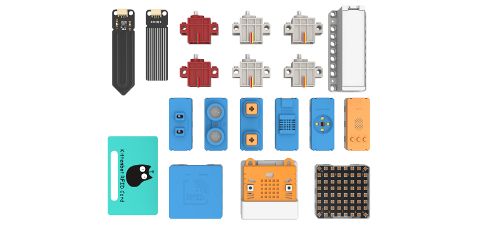

### 套件內容:
-  Armourbit Expansion Box x1
-  Armourbit Battery Box x1
-  Sensor Kit x1
-  PH2.0 Cables x1
-  GeekServo 9G Servos x4
-  GeekServo 9G Motors x2
-  18650 Battery x1
-  Bag of Building Blocks x1 (HKBK8039B Only)
-  Instructions x1

### List of Modules:

1. Temperature+Moisture Sensor Module
1. Soil Moisture Sensor Module
1. Water Sensor Module
1. Ultrasound Sensor Module
1. Twin IR Line Tracing Module
1. Twin Buttons Module
1. Colour & Gesture Sensor Module
1. RFID Module with RFID Card
1. RGB LED Matrix Module
2. MP3 Player Module

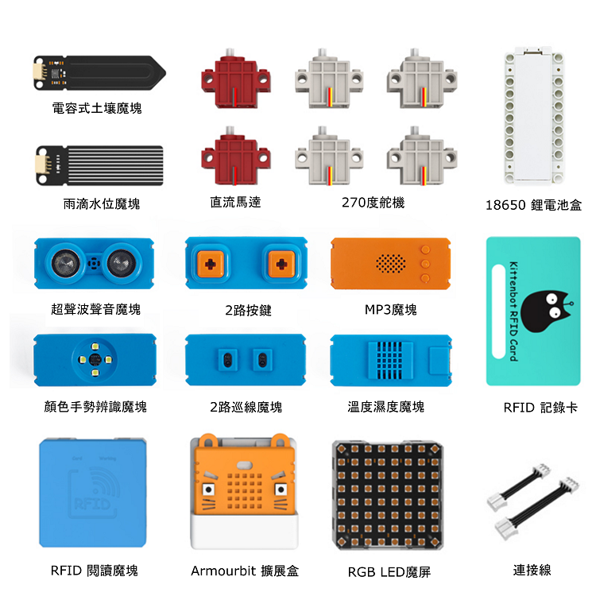

## Compatibility with building blocks

### 3x7 Modules

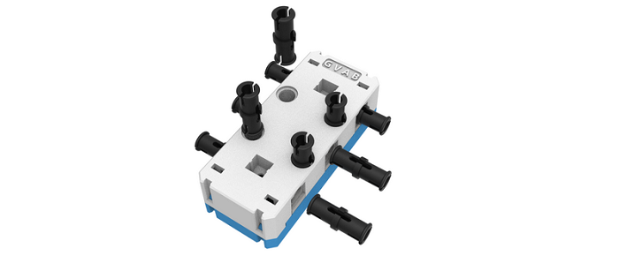

### 7x7 Modules

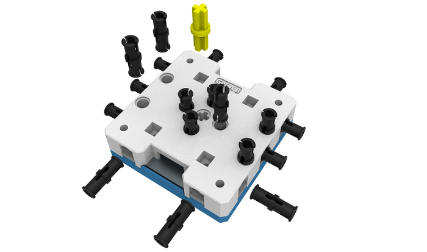

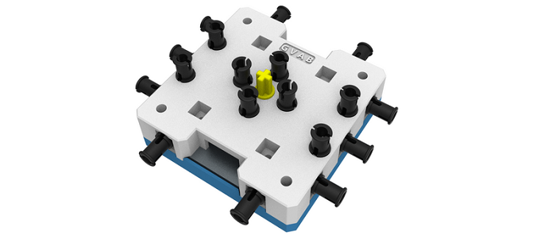

### Battery Box

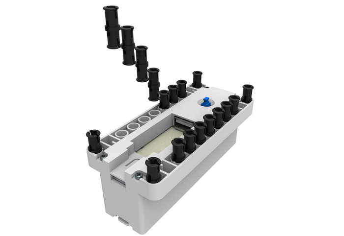

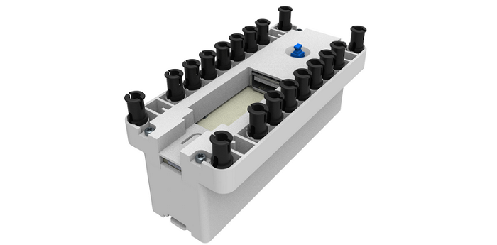

### Armourbit Expansion Box

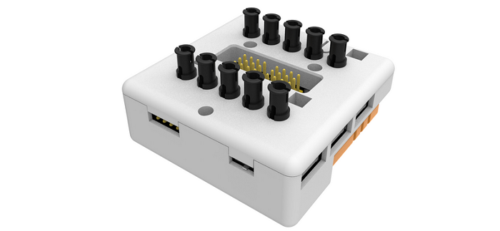

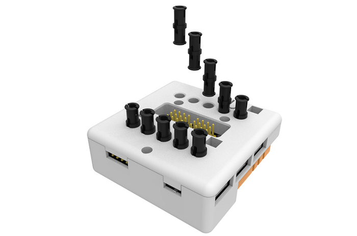

### Compatibility Showcase

It is easy to use your existing building blocks to create unique machines.

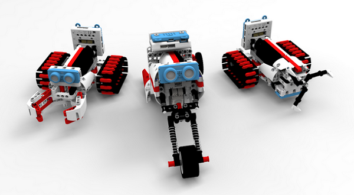

## Easy-to-connect Cables

The connection cables are designed to prevent inverted connections.

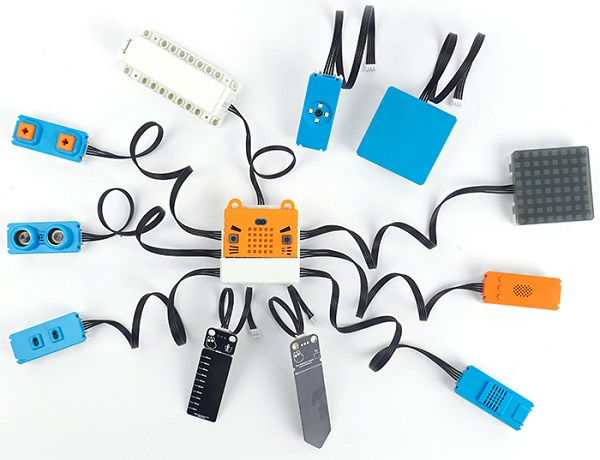

### 4Pin Flexible Connection Cable

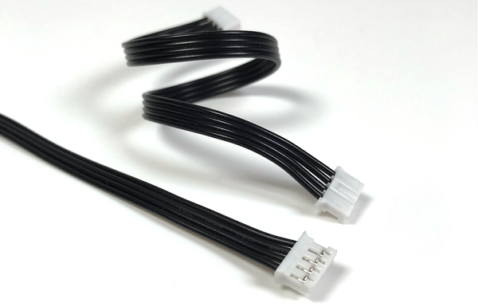

## Microsoft MakeCode

Powerbrick can be programmed using Microsoft's MakeCode editor.

## Kittenblock

Kittenblock is a programming platform developed by Kittenbot for STEM education.

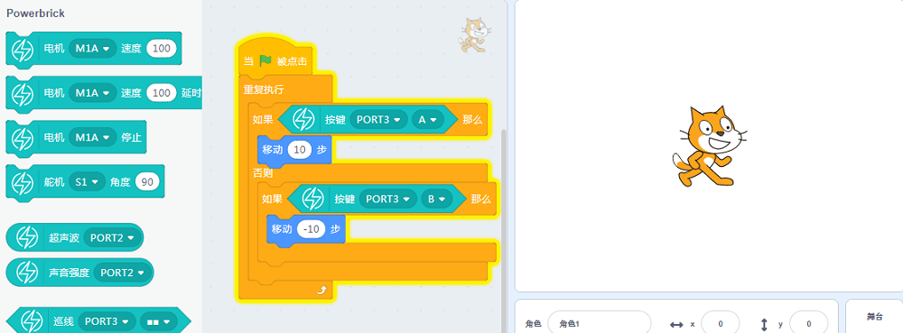

## FAQ

**1. Does Powerbrick only work with the 10 sensor modules included?**

Answer: No, Powerbrick can work with other modules by Kittenbot. Powerbrick includes 10 of the most common modules, additional modules can be purchased.

**2. Are the individual moduels in Powerbrick available to purchase?**

Answer: Yes, the modules are all available to purchase, it is not necessary to purchase the entire kit to get the modules.