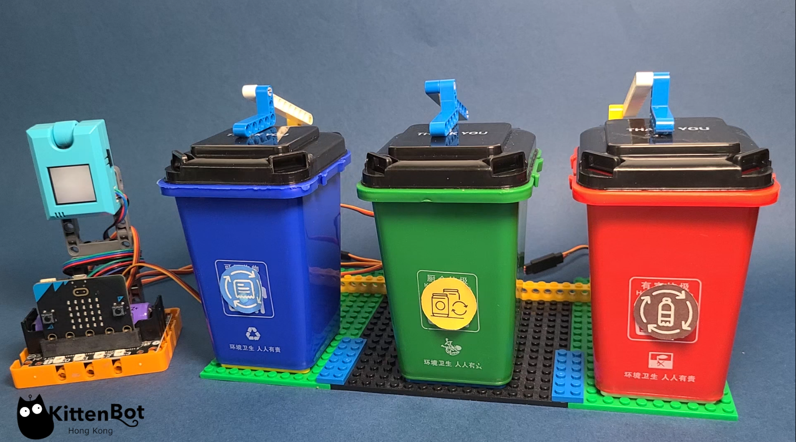
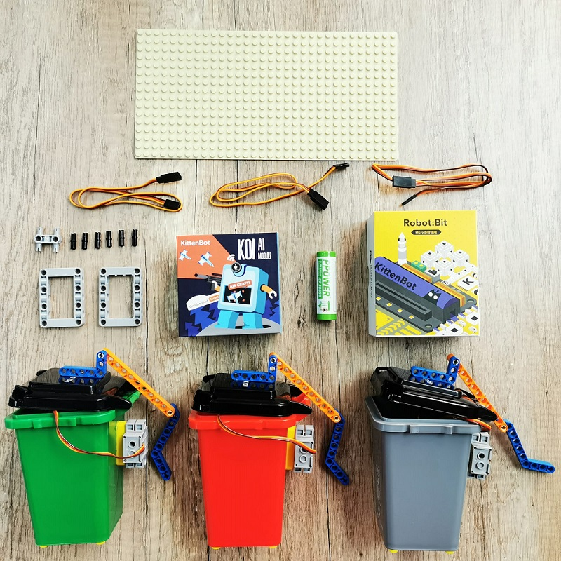
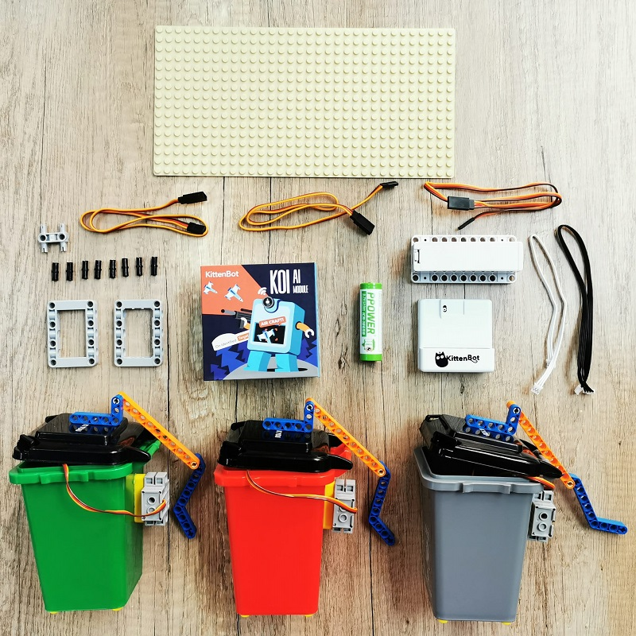
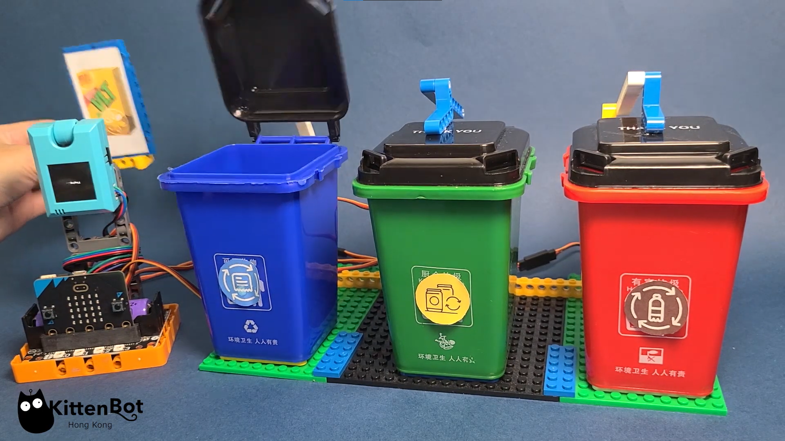

# AI/AIoT Recycling Bin

AI/AIoT Recycling Bin is a kit set designed for Micro:bit. The kit uses the Machine Learning capabilities of the KOI to achieve garbage classifications. In addition, this kit can be upgraded to AIoT by making use of the KOI's IoT functions and IoT Platforms.

KittenBot希望透過此套件，培養學生對環保與保護地球的意識，在STEM的學習的同時亦能提升學生的人文素養。

## Special Features

- Combining AI and Environmental Conservation topics, increasing the awareness of environmental protection
- Easy implementation of AIoT
- Compatible with plastic building bricks
- Supports graphical programming via Microsoft MakeCode
- Comes with a container for easy storage and clean up after each lesson

## Kit Contents

### Robotbit Version

### Armourbit Version

### List of Contents

- KOI AI Camera with 128MB SD Card x1
- Armourbit+ Battery Box / Robotbit Edu x1
- 18650 Lithium Ion Battery x1
- GeekServo 9G Servos x3
- Servo Extension Cables x3
- Toy Rubbish Bins x3
- Plastic Building Blocks
- Base Plate

## Demo Video

