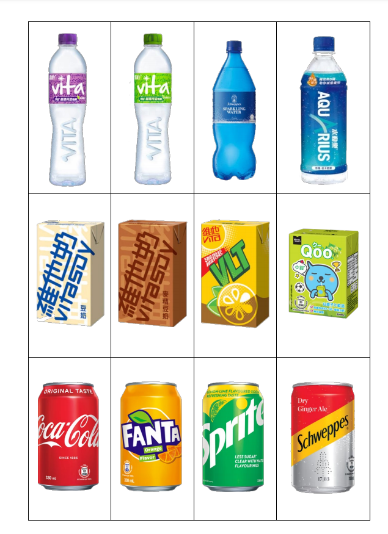
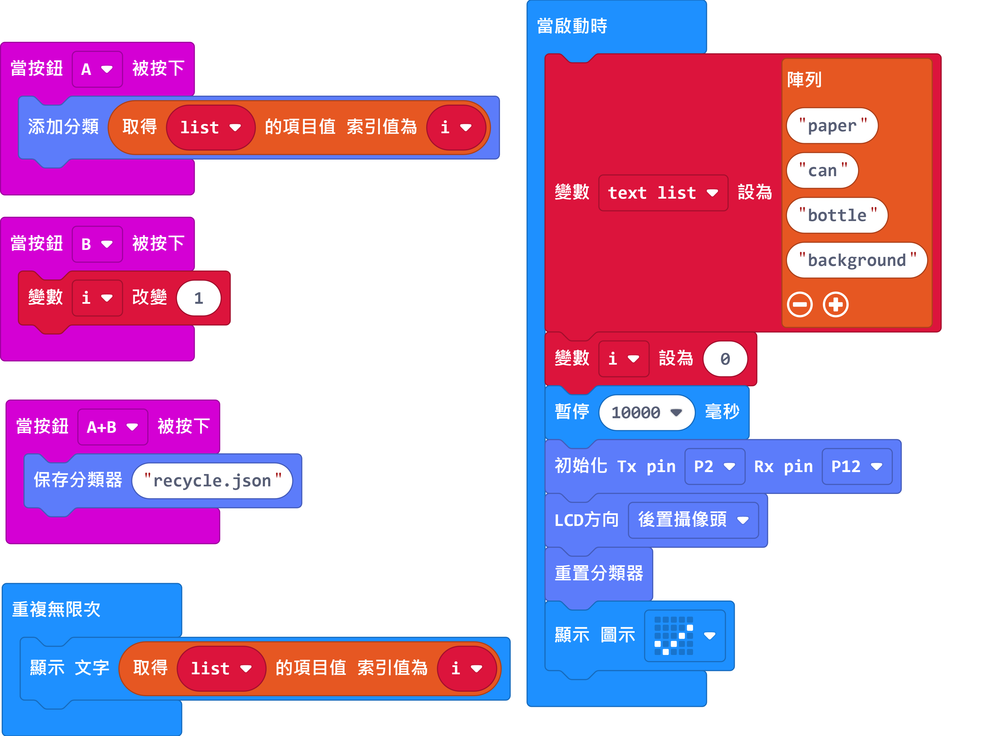
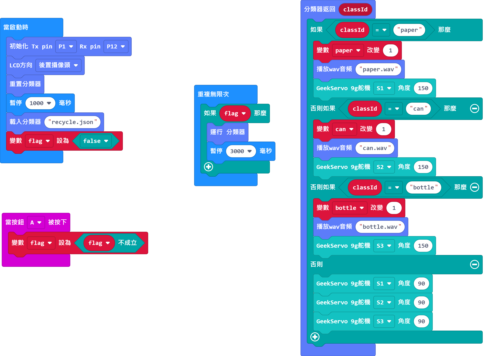
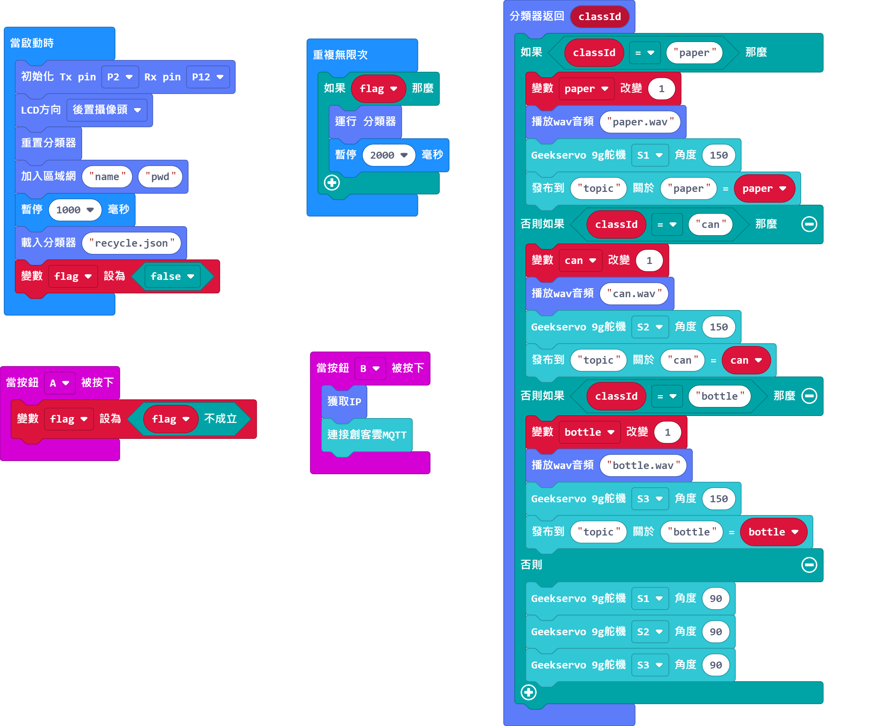
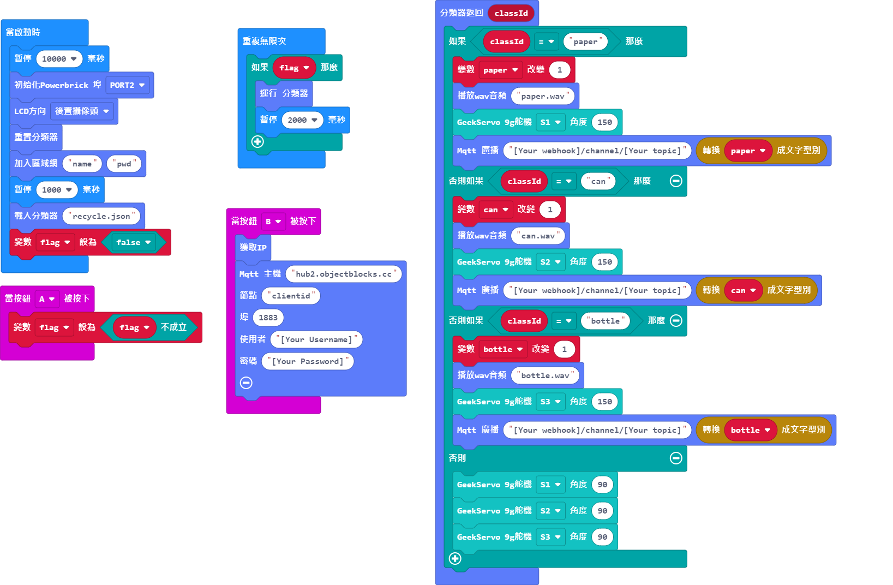

# AI/AIoT Recycling Kit Tutorial

### Resource Pack

[Wav Files](https://drive.google.com/file/d/1GEJpytMGa4GYDSfpvDlvfwSC0fG-qENg/view?usp=sharing)

[Sample Pictures](https://drive.google.com/drive/folders/1l27lVZQ-IEcx-_u2yh-VkV3N75coOGbE?usp=sharing)

## Model Training Program

[Armourbit Version](https://makecode.microbit.org/_Am5gsgJ0J6WP)

[Robotbit Version](https://makecode.microbit.org/_7WJFv0199PFv)

### Training Procedure

1. Micro:bit shows the current classification.
1. Press A to train the current classification.
2. Press B to move on to the next classification.
3. Press A+B to save the model.

## AI Recycling Sample Program

[Armourbit Version](https://makecode.microbit.org/_EErK8LD3U4zr)

[Robotbit Version](https://makecode.microbit.org/_7x9XHo1Wpa0T)

### Model Procedure

1. Press A to enable identification.
2. The corresponding recycling bin will open after identifying the garbage.

## AIoT Recycling Sample Program

### MakerCloud Version

[Armourbit Version](https://makecode.microbit.org/_2FLaVKhxbEWU)

[Robotbit Version](https://makecode.microbit.org/_hER07TKE3Uiz)

### Model Procedure

1. Press A to enable identification.
2. Press B to connect to the IoT platform.
3. The corresponding recycling bin will open after identifying the garbage.

### ObjectBlocks Version

[Armourbit Version](https://makecode.microbit.org/_E28TWW0Fe46L)

[Robotbit Version](https://makecode.microbit.org/_0YgJR1hf7T5J)

### Model Procedure

1. Press A to enable identification.
2. Press B to connect to the IoT platform.
3. The corresponding recycling bin will open after identifying the garbage.
