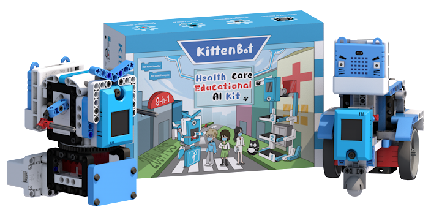
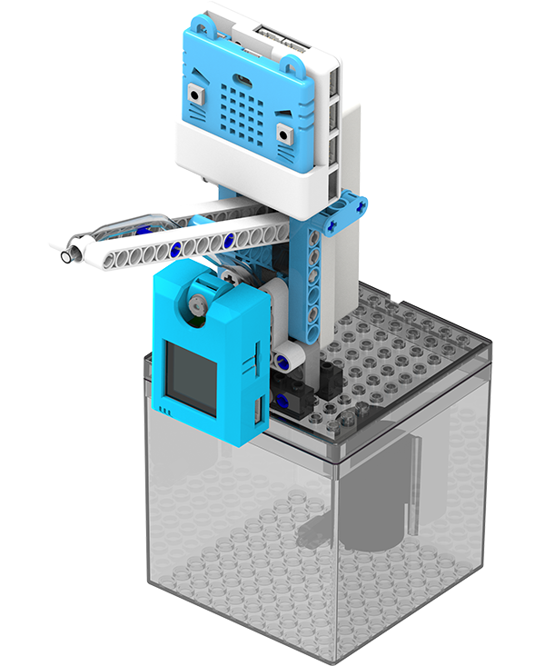
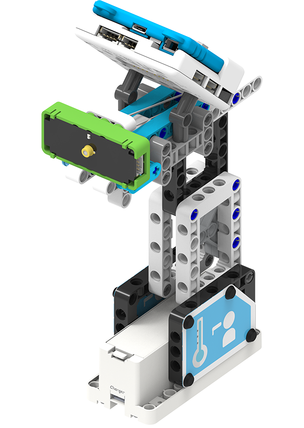
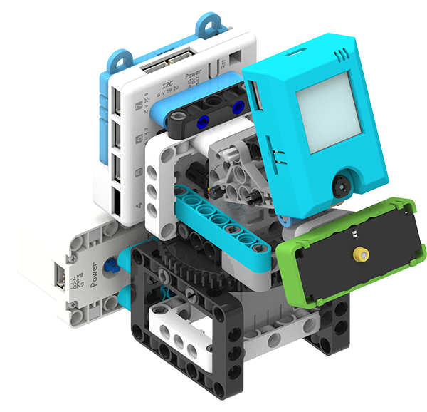
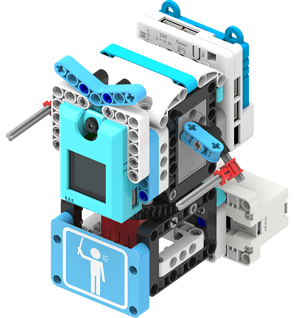
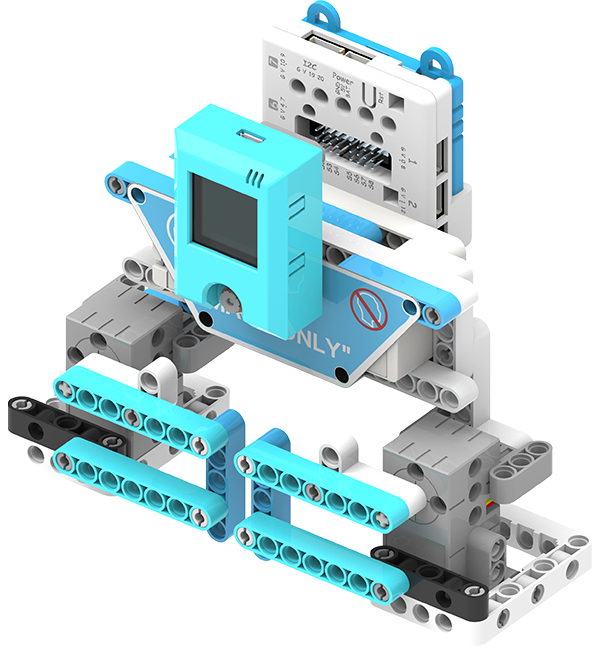
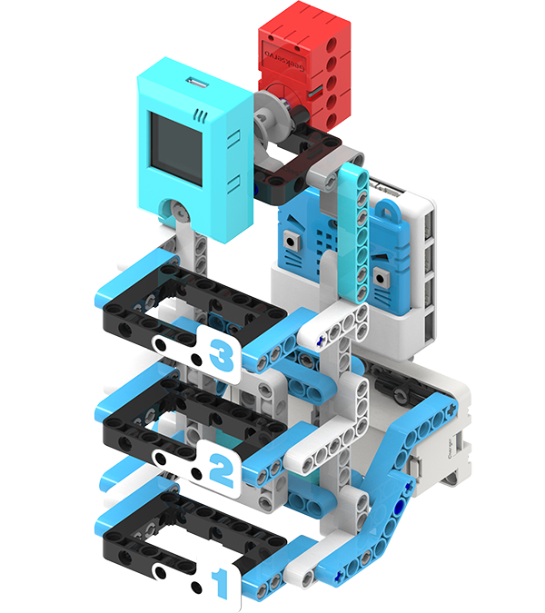
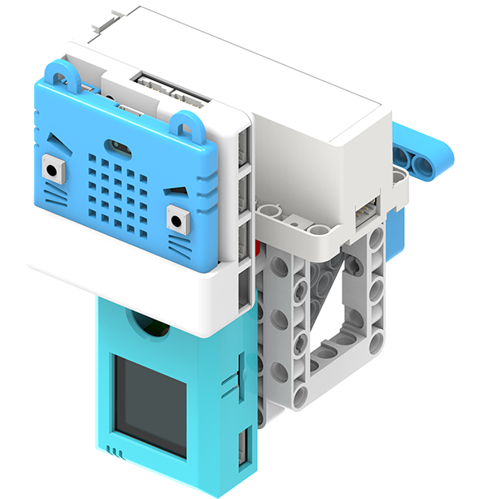
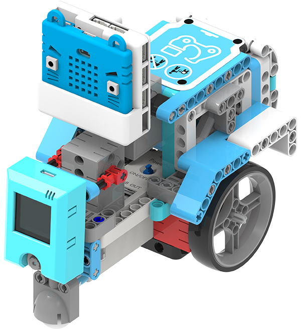
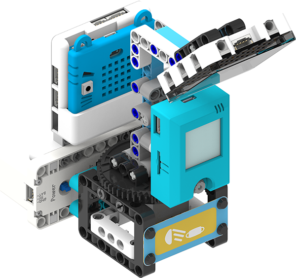

# Health Care Educational AI Kit

### Health Care Educational AI Kit (HKBK8034A)

## Product Background

The spread of Covid-19 has increased the public's awareness of hygiene and disease prevention.
The public has learnt the importance of disease prevention measures, in sight of this, Kittenbot releases this educational kit set to bring these topics into the classroom.
The various hygiene and disease prevention use cases can teach students the importance of hygiene and experience the integration of AI into our daily lives.

## Contents

- Armourbit Expansion Board x1

- Armourbit Battery Box x1

- 2KG GeekServo Servos x2

- 2KG GeekServo Motors x2

- KOI AI Camera x1

- Infra-Red Temperature Sensor x1

- 18650 Rechargeable Battery x1

- RGB LED Matrix Module x1

- Water Pump+Water Tank x1

- 4pin Cables x4

- 3pin Cable x1

- 1m USB Cable x1

- Building Bricks(200 Pieces) x1

- Black Tape x1

- Instructions x1

- Micro:bit Silicon Jacket x1

- Decoration Cards x1

- MicroSD Card x1

  

## Use Cases

### AI Disinfection Alcohol Dispenser

Using Machine Learning, the model can automatically dispense disinfection alcohol when a hand is detected.

[AI Disinfection Alcohol Dispenser Demo Video](https://youtu.be/onL8VfX7MMo)

### Handheld Contactless Temperature Monitor

A handheld contactless temperature sensor.

### Auto-Tracking Temperature Monitor

This machine tracks faces and measure their temperatures.

[Auto-Tracking Temperature Monitor Demo Video](https://youtu.be/3xKiPECyDeo)

### Anti-epidemic Supplies Commander

Using Machine Learning to recognize different kinds of anti-epidemic supplies.

[Anti-epidemic Supplies Commander Demo Video](https://youtu.be/ZkUQEeERP5w)

### Mask Detector

Using machine learning, the gate will only be opened to people who are wearing a mask.

[Mask Detector Demo Video](https://youtu.be/QdFkcH57gtw)

### Contactless Elevator

Using machine learning, the elevator can be controlled with gestures.

[Contactless Elevator Demo Video](https://youtu.be/EjaEEezd9rQ)

### Contactless Door Bell

The door bell is automatically triggered when a face is detected.

### Driverless Delivery Cart

Driverless Food Delivery can be realized using line tracing and QR Code Identification.

### UV Light Sterilizer

Using machine learning, the machine can sterilize various items.

