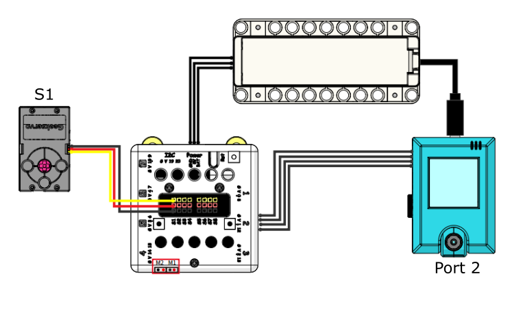
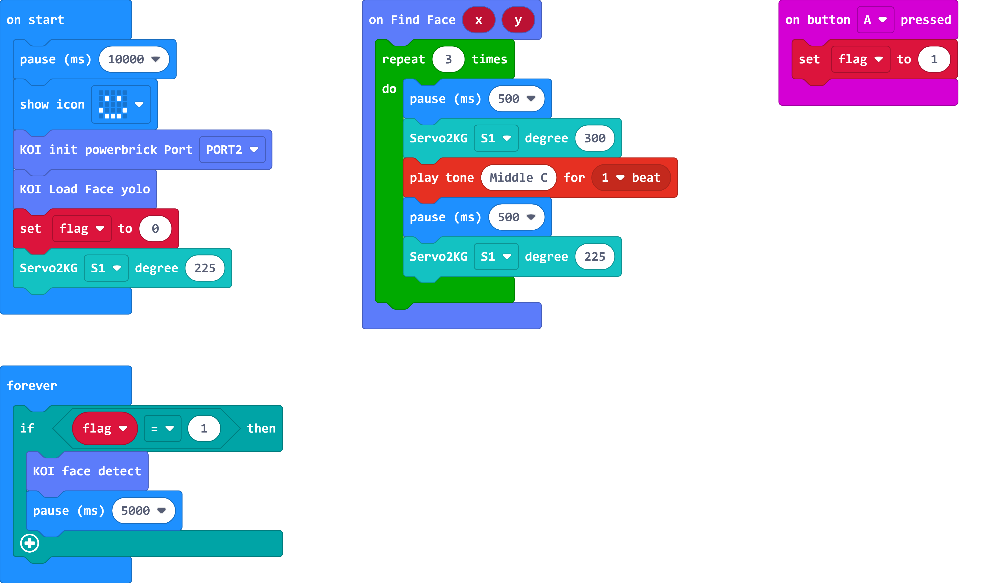

# Contactless Door Bell

Touching public facilities is something that should be avoided during a pandemic. This model simulates a contactless door bell.

## Building Instructions

[Building Instructions Resource Pack Download](https://bit.ly/AIHealthCareSetBuildingGuide)

## Sample Wiring

## Sample Program

[Contactless Door Bell](https://makecode.microbit.org/_YFV5b8Ax7aqr)

## Model Instructions

1. Switch on the power and wait 10 seconds for the KOI to power on completely.

2. Press A to start recognition.

3. The model presses on the door bell when a face has been detected.

