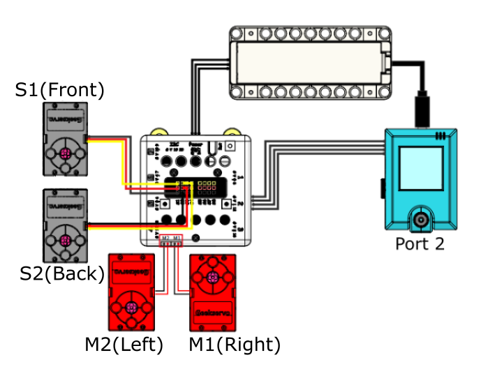
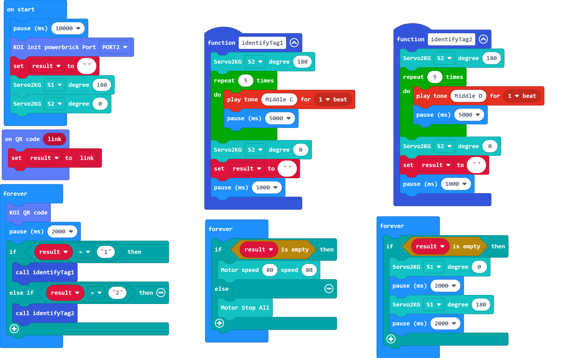

# Driverless Delivery Cart

Ordering takeout delivery is common during the pandemic, this model simulates a driverless delivery cart.

## Building Instructions

[Building Instructions Resource Pack Download](https://bit.ly/AIHealthCareSetBuildingGuide)

## Sample Wiring

## Sample  Programs

[Driverless Delivery Cart-Line Tracing Mode](https://makecode.microbit.org/_58Hekq255Kop)

[Driverless Delivery Cart-QR Code Mode](https://makecode.microbit.org/_LboPVwaYrY54)

[Sample Program Resource Pack](https://bit.ly/AIHealthCareSetHex)

### Line Tracing Mode:

### QR Code Mode:

## Model Instructions

### Line Tracing Mode:

1. Reset the Micro:bit after the KOI has been powered on.

2. Put the cart onto a black line and press A to begin colour calibration.

3. Press B to start the cart.

### QR Code Mode:

1. Reset the Micro:bit after the KOI has been powered on.

2. The cart will move forward slowly.

3. Show a QR code to the camera, if the code is correct, the container will be opened for food delivery.

