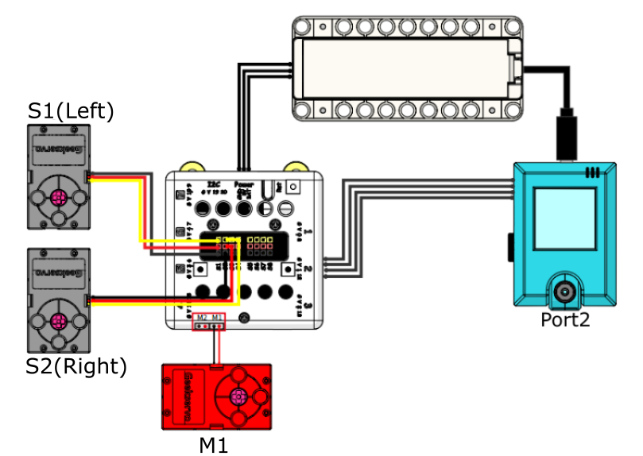
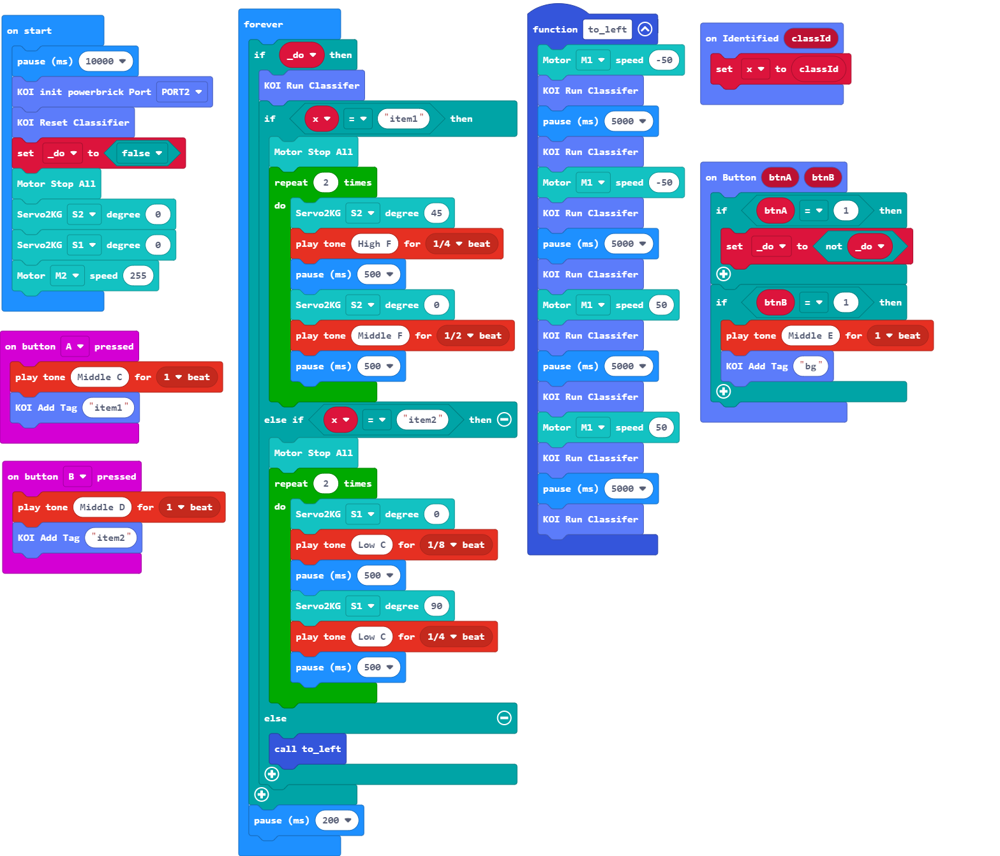

# Anti-epidemic Supplies Commander

It is important to prepare the necessary anti-epidemic supplies, this model identifies different anti-epidemic supplies.

## Building Instructions

[Building Instructions Resource Pack Download](https://bit.ly/AIHealthCareSetBuildingGuide)

## Sample Wiring

## Sample Programs

[Anti-epidemic Supplies Commander](https://makecode.microbit.org/_hHe2g954FgVf)

[Sample Program Resource Pack](https://bit.ly/AIHealthCareSetHex)

## Model  Instructions

1. Reset the Micro:bit after the KOI has been powered on.

2. Hold the first item and press B to train the model to recognize that item.

3. Hold the second item and press B to train the model to recognize that item.

4. Aim the KOI at the background and press B to train the model to recognize the background.

5. Press A to start recognizing, the model will wave its arms when an item is recognized.

