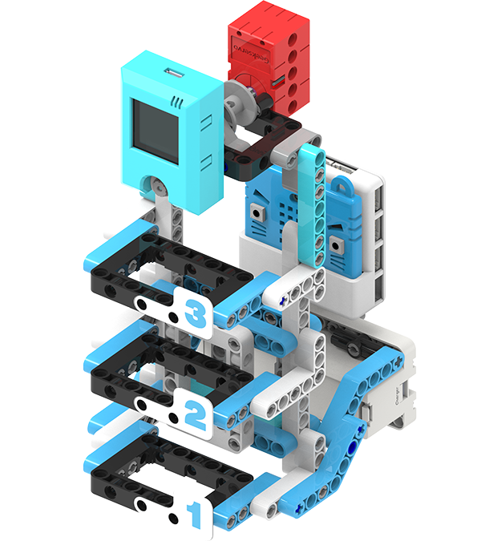

# Contactless Elevator

Touching public facilities is something that should be avoided during a pandemic. This model simulates a contactless elevator.

## Building Instructions

[Building Instructions Resource Pack Download](https://bit.ly/AIHealthCareSetBuildingGuide)

## Sample Wiring

## Sample Program

[Sample Program Resource Pack](https://bit.ly/AIHealthCareSetHex)

## Model Instructions

### 1. Model Training

1. Reset the Micro:bit after the KOI has been powered on.

2. Make the gesture for Ground Floor and press B. Repeat for about 3 times.

3. Press A to move on to the next floor.

4. Train the model to recognize the background by pressing B when the camera is looking at the background.

5. Press A+B to save the model.

### Contactless Elevator

1. Reset the Micro:bit after the KOI has been powered on.

2. Press B to start recognition.

3. The elevator will move to the floor corresponding to the gesture.

