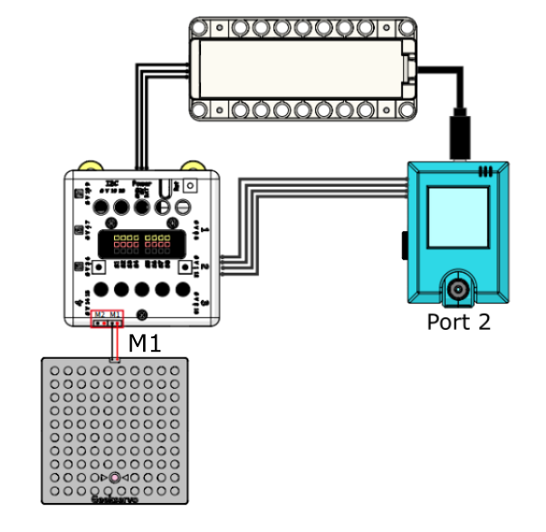

# AI Disinfection Alcohol Dispenser

Hand Sanitation is one of the most important parts of anti-pandemic practices, this model simulates an automatic hand wash dispenser.

## Building Instructions

[Building Instructions Resource Pack Download](https://bit.ly/AIHealthCareSetBuildingGuide)

## Sample Wiring

## Sample Programs

### Training Program

[Training Program](https://makecode.microbit.org/_4KC2zeDPr69H)

### AI Disinfection Alcohol Dispenser

[AI Disinfection Alcohol Dispenser](https://makecode.microbit.org/_MreTHbcWAhR0)

## Model Instructions

### 1. Model Training

1. Switch on the power and wait 10 seconds for the KOI to power on completely.

2. Hold your palm in front of the camera and press B. Repeat this action after changing the angle of your palm.

3. When the above step is done, press A to move on.

4. Train the model to recognize the background by pressing B when only the background is visible through KOI.

5. Save the trained model by pressing A+B.

### 2. Using the AI Disinfection Alcohol Dispenser Program

1. Switch on the power and wait 10 seconds for the KOI to power on completely.

2. Press A to load the trained model, press B to begin recognition.

3. Upon recognizing a palm, the machine will dispense a small amount of hand sanitizer.

4. Pressing B will stop the recognition.

