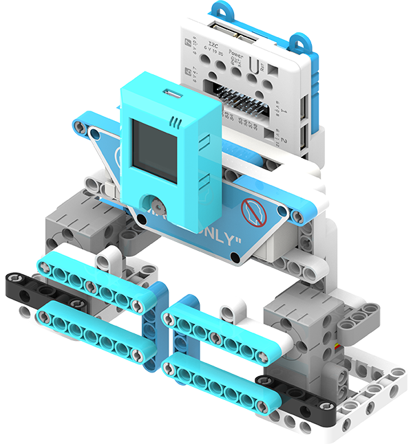

# Mask Detector

Many premises require visitors to wear a mask, this model simulates a gate where only people who are wearing a mask are allowed entry.

## Building Instructions

[Building Instructions Resource Pack Download](https://bit.ly/AIHealthCareSetBuildingGuide)

## Sample Wiring

## Sample Program

[Mask Detector](https://makecode.microbit.org/_2t3CoUa389R0)

## Model Instructions

1. Switch on the power and wait 10 seconds for the KOI to power on completely.

2. Wear a mask then face the camera and press A.

3. Take off the mask then face the camera and press A.

4. Press button B of the KOI when the camera is looking at the background.

5. Press button A of the KOI to begin recognition.

