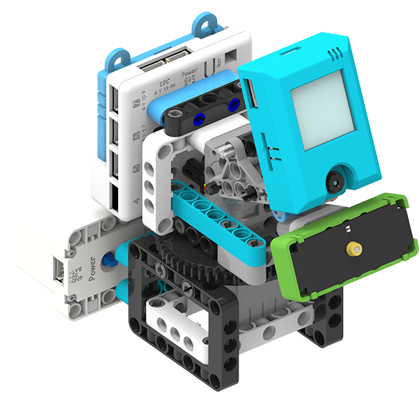

#  Auto-Tracking Temperature Monitor

Ensuring the visitors do not possess symptoms such as fever is key part in anti-pandemic effort, this model simulates an automatic temperature sensor.

## Building Instructions

[Building Instructions Resource Pack Download](https://bit.ly/AIHealthCareSetBuildingGuide)

## Sample Wiring

## Sample Programs

[Auto-Tracking Temperature Monitor](https://makecode.microbit.org/_LgbPjdAbdbYf)

## Model Instructions

1. Switch on the power and wait 10 seconds for the KOI to power on completely.

2. The model will track and detect faces.

3. When a face is detected, it initiates a countdown of 3 seconds.

4. The temperature is displayed on the Micro:bit.

