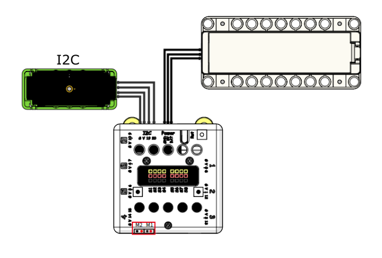
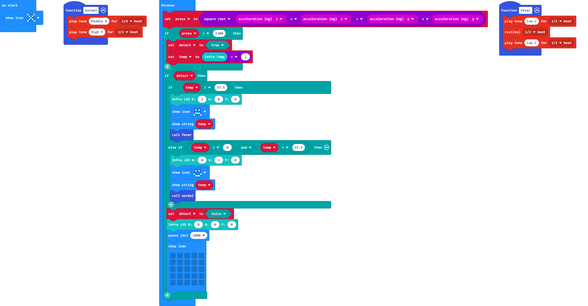

# Handheld Contactless Temperature Monitor

Ensuring the visitors do not possess symptoms such as fever is key part in anti-pandemic effort, this model simulates a contactless handheld temperature sensor.

## Building Instructions

[Building Instructions Resource Pack Download](https://bit.ly/AIHealthCareSetBuildingGuide)

## Sample Wiring

## Sample Programs

[Handheld Contactless Temperature Monitor](https://makecode.microbit.org/_6zedo5PpWMdP)

## Model Instructions

Aim the temperature sensor at a person's forehead and pull the trigger. The person's temperature will be displayed. (For best results, the sensor should be approximately 3cm away from the surface.)
