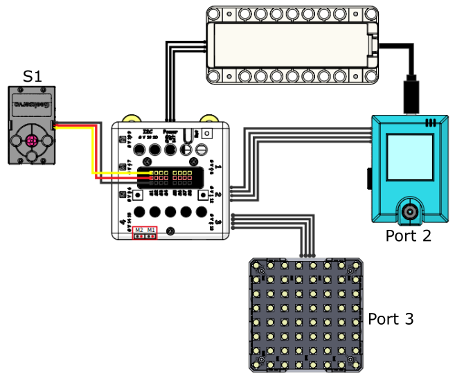
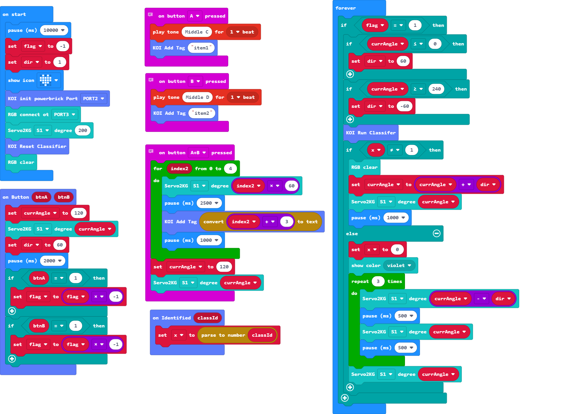

# UV Light Sterilizer

Sterilizing is an important part in anti-epidemic effort, this model simulates a UV sterilizer.

## Building Instructions

[Building Instructions Resource Pack Download](https://bit.ly/AIHealthCareSetBuildingGuide)

## Sample Wiring

## Sample Programs

[UV Light Sterilizer](https://makecode.microbit.org/_AP5ioadg0eg4)

[Sample Program Resource Pack](https://bit.ly/AIHealthCareSetHex)

## Model Instructions

1. Switch on the power and wait 10 seconds for the KOI to power on completely.

2. Hold the first item and press A to train the model to recognize that item.

3. Hold the second item and press B to train the model to recognize that item.

4. Press A+B to train the model to recognize the background.

5. Press any button on the KOI to start recognition.

6. The light will turn on when an item is recognized.

