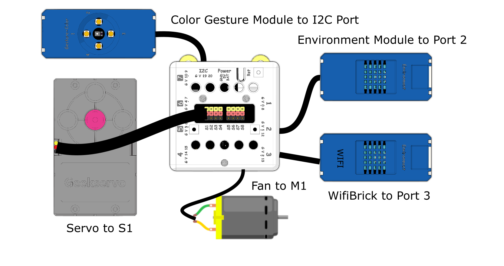
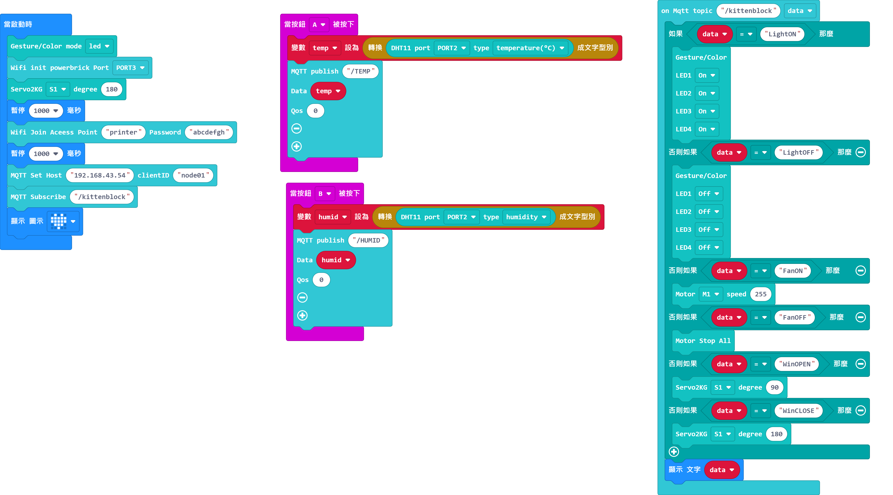
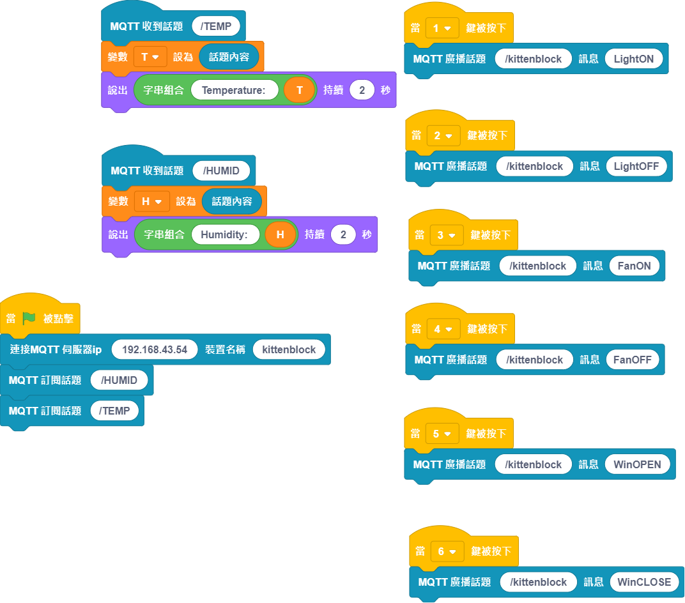
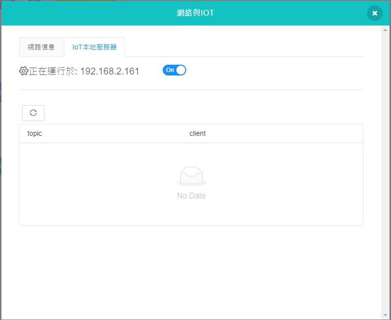

# Smart Bedroom

Modern home appliances are able to be controlled via IoT, in this example a smart bedroom equipped with smart appliances is simulated.

## Building Instructions and Sample Programs

[Download Resource Pack](http://bit.ly/AIOTKit_SH_ResourcsePack)

## Sample Wiring:

## IoT extension:

IoT:

## Micro:bit Sample Program:

[Sample Program Download](https://makecode.microbit.org/_LErLcJWgL42D)

## IoT Sample Program:

## Activating the local IoT server

## Model Procedure

1. In the IoT Program on KittenBlock, turn on the local server.
2. Power on the model and wait for the WifiBrick to connect to the internet.
3. The character will report the current temperature and moisture periodically after pressing A on the Micro:bit.
3. Use the IoT program to control the appliances.