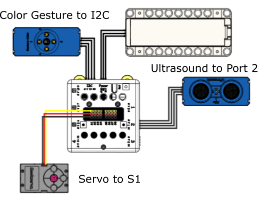
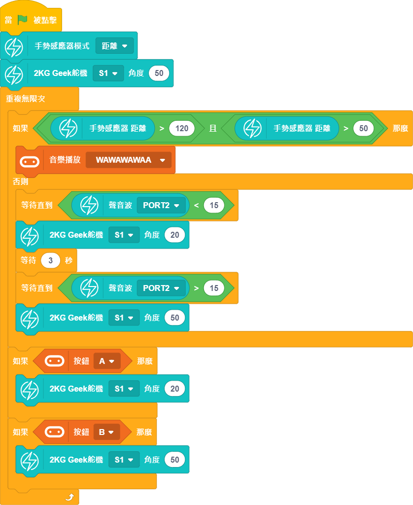

# Smart Rubbish Bin

It is important to keep our rubbish bins hygienic, in order to ensure the safe and hygienic operation of refuse collection, this example simulates a smart rubbish bin that locks itself when it is too full while signaling the workers to clean up.

## Building Instructions and Sample Programs

[Download Resource Pack](http://bit.ly/AIOTKit_SH_ResourcsePack)

## Sample Wiring: 

## Sample Program:

## Model Procedure

1. Upload the program onto Micro:bit.
2. The rubbish bin automatically opens when a hand approaches.
3. Press A or B to open or close the rubbish bin when it is full.